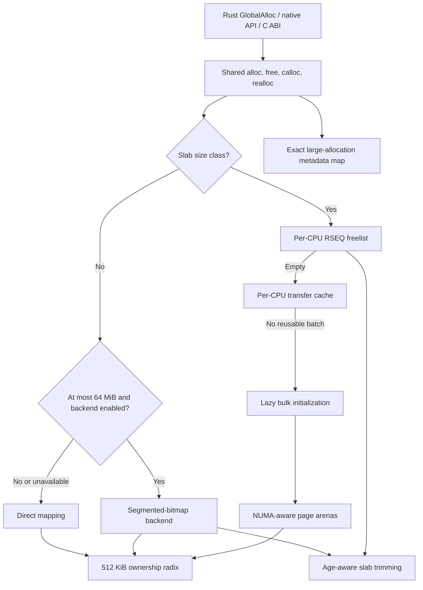
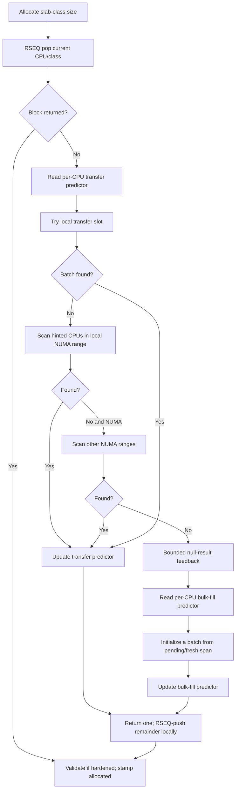
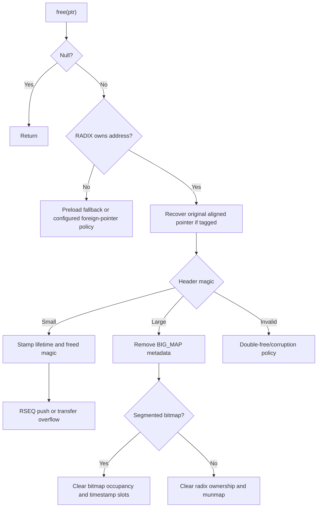

# RSMalloc Architecture

This document describes the current `0.3.0-alpha` architecture. RSMalloc is experimental: internal layouts and policies may change before a stable release, but the invariants documented here are the ones the current implementation relies on.

RSMalloc currently targets stable Rust on Linux `x86_64`; the optional `allocator-api` feature requires nightly while `std::alloc::Allocator` remains unstable. RSMalloc requires libc-provided Restartable Sequences (RSEQ) TLS state.

## Design Model

RSMalloc separates allocation into three scales:

1. **Slab allocations**, through `2 MiB`, use size classes and RSEQ-managed per-CPU freelists.
2. **Segmented-bitmap allocations**, normally `4–64 MiB`, reuse power-of-two blocks from NUMA-local 64 MiB segments.
3. **Direct allocations** use dedicated mappings when an allocation is outside the reusable large-object backend or that backend cannot satisfy it.

The central ownership rule for small objects is:

> A free block belongs to the CPU cache that currently holds it, not permanently to the thread or CPU that originally allocated it.

Threads therefore do not own small-allocation heaps. RSEQ makes the local CPU cache cheap to access, transfer caches redistribute excess blocks, and the page allocator supplies backing memory when reuse cannot satisfy demand.

## System Overview



The page allocator is the shared reservation layer. It backs slab refill spans, segmented-bitmap regions and metadata, radix nodes, and other allocator metadata when requests fit its arena policy. Direct `mmap` remains the fallback for unsuitable or very large reservations.

## Source Layout

| Area | Responsibility |
| --- | --- |
| `src/frontend/` | Rust global allocator APIs, the v2 native API/configuration surface, stats, and the preload C ABI. |
| `src/inner/` | Shared allocation, free, calloc, aligned allocation, realloc, and preload fallback behavior. |
| `src/rseq_core/` | RSEQ TLS access, per-CPU slab caches, assembly critical sections, transfer caches, pending refill metadata, and bulk initialization. |
| `src/backend/page_allocator.rs` | NUMA-aware arena reservation and atomic bump allocation. |
| `src/backend/background_thread.rs` | Background timestamps, trimming policy, and memory-pressure relief. |
| `src/big_allocations/` | Segmented-bitmap reuse and direct large allocations. |
| `src/internals/` | Ownership radix, large metadata map, locks, NUMA parsing/binding, and initialization primitives. |
| `src/core_prim/` | Adaptive predictors, hardware helpers, random magic initialization, fork support, and pointer wrappers. |
| `src/utility.rs` | Size classes, refill limits, alignment helpers, and size matching. |

## Bootstrap and Global State

Both Rust and preload frontends eventually call `backend::bootstrap::main_bootstrap`.

Bootstrap:

1. verifies libc's RSEQ offset and size;
2. installs runtime tuning values;
3. initializes the ownership radix;
4. maps the per-CPU slab-cache table and NUMA topology;
5. initializes the pending refill queue;
6. initializes per-node page arenas;
7. initializes the segmented-bitmap backend;
8. registers preload fork handlers when applicable;
9. initializes randomized header magic and aligned-allocation tags when enabled.

Initialization is intentionally allocator-internal. Metadata is obtained from anonymous mappings or the page allocator rather than recursively allocating through the public allocator.

## Allocation Classification

`utility::match_size_class` maps requests through `2 MiB` to one of 34 slab classes. Requests through 4 KiB use a lookup-oriented fast path; larger slab requests use the remaining class table.

Every allocation has an internal `Header` immediately before its ordinary payload. The default header is 16-byte aligned and 16 bytes wide; `extended-header` uses a 32-byte variant. The first field and positioning are assembly-sensitive because free blocks reuse `Header::next` as their intrusive list link.

Requests not represented by a slab class enter `big_malloc`.

## Small Allocation Path



### Local RSEQ cache

Each CPU owns a page-aligned `MainCache`:

```rust
#[repr(C, align(4096))]
pub struct MainCache {
    cache: [RseqCache; NUM_SIZE_CLASSES],
    mail: [TransferCache; NUM_SIZE_CLASSES],
    transfer_batching: [AdaptiveBatching; NUM_SIZE_CLASSES],
    bulk_fill_batching: [AdaptiveBatching; NUM_SIZE_CLASSES],
    pending_refill: [AtomicPtr<MetaData>; NUM_SIZE_CLASSES],
}
```

`RseqCache` contains:

- an intrusive freelist head manipulated by RSEQ;
- an atomic usage counter used to enforce per-class high-water limits.

The 4096-byte alignment separates CPU state, supports NUMA binding of CPU ranges, and prevents unrelated CPUs from sharing the same cache page. The layout is compile-time asserted to remain exactly 4096 bytes, including the per-class pending-refill pointers.

### RSEQ commit protocol

The RSEQ assembly in `rseq_core/slab_cache/rseq_asm.rs` follows this shape:

1. install the operation's static RSEQ descriptor in libc's `rseq_cs` field;
2. compare the registered CPU ID with the CPU sampled by the caller;
3. prepare the list operation;
4. commit by storing the new shared freelist head;
5. execute usage accounting after `post_commit_ip`.

The shared freelist-head store is the commit point. Linux restarts execution at the abort handler if migration or preemption invalidates the critical section before that point. RSEQ does **not** roll back arbitrary stores, so only publication of the new shared head is treated as transactional; preparatory writes are limited to unpublished/free nodes where repeating them is safe.

The usage update is a locked atomic operation after commit. Moving it before the commit would be incorrect because an RSEQ abort would not undo it. The counter is used for pressure policy, while the list head is the source of freelist correctness.

`rseq_cs` intentionally remains installed after an operation. The descriptors and referenced assembly have process lifetime, and every operation installs its own descriptor. Linux requires clearing before descriptor or code reclamation, which does not occur here.

### Cache overflow and abort fallback

A free or returned batch is pushed to the local RSEQ cache while its usage is below `CACHE_HIGH_BLOCKS[class]`. If the high watermark is reached, a single block or batch is sent to that CPU's transfer cache instead.

Single-block push retries a bounded number of RSEQ aborts before using the transfer cache. A batch push falls back to the transfer cache after an unsuccessful RSEQ attempt because the batch is already available as a linked range.

## Transfer Cache

A transfer slot exists for every `(CPU, size class)` pair:

```rust
pub struct TransferCache {
    pub list: AtomicU128,
    pub trimmed: AtomicU128,
    pub trim_lock: SpinLock<()>,
}
```

It serves four roles:

- overflow from full local RSEQ caches;
- batch reuse when another CPU's local cache is empty;
- fallback after repeated RSEQ push failures;
- separate publication of blocks whose payload pages were reclaimed.

### ABA-safe heads

Each transfer head is a 128-bit value:

```text
high 64 bits: generation
low  64 bits: complete pointer
```

Every successful update advances the generation. The full pointer remains intact, so the design does not depend on spare pointer bits or on a 48/56-bit virtual-address assumption. Push uses release publication; pop acquires the published list.

### Batch pop

A pop walks at most the requested number of intrusive nodes, then atomically replaces the head with the first unclaimed node. The normal list is checked before the trimmed list. If the selected list empties, its availability hint is cleared and both heads are rechecked to repair the important concurrent-push false-negative race.

### Spatial adaptation: transfer hints

Per-class bitmaps record CPUs whose transfer slot is probably nonempty. They are **advisory**:

- an empty-to-nonempty push sets a bit;
- an observed empty slot clears it;
- a clearing operation rechecks both transfer heads and restores the bit if necessary.

The transfer head remains the source of correctness. A stale hint may add or skip probing work, but cannot allocate an invalid block.

A second bitmap marks slots currently being stolen. Scans first prefer unclaimed victims, then make a forced pass so stale or contended markings cannot permanently hide available memory.

Victim order is:

1. the current CPU's transfer slot;
2. hinted CPUs in the current NUMA range;
3. hinted CPUs in other NUMA ranges.

This makes the transfer system adaptive in two dimensions: hints predict **where** reusable blocks are, while batch predictors estimate **how many** to request.

### Trimming synchronization

`trim_lock` protects the detach/classify/republish interval used by slab trimming. Ordinary allocation-side probes do not block on an active trim pass; they treat that slot as temporarily unavailable and continue searching. The forced fallback pass waits for republished state so a temporarily detached list cannot hide reusable memory indefinitely.

## Per-CPU Refill Prediction

Each `MainCache` has separate predictors for transfer reuse and bulk initialization. Predictors are indexed by CPU and size class because they model the cache being accessed, not the identity of the calling thread.

`AdaptiveBatching` packs two values into one `AtomicUsize`:

```text
high bits: predicted batch
low byte:  consecutive low-observation count
```

Zeroed mapped storage means “use the configured initial batch.” Selection is a relaxed load. Feedback uses a single relaxed `compare_exchange_weak`; a failed update is dropped because prediction is advisory and retrying would add contention without affecting correctness.

The update policy is asymmetric:

```text
if observed > batch:
    batch = max(batch + batch / 2, observed), bounded by class maximum
else if observed * 4 < batch for four observations:
    batch = max(batch / 2, 1)
else:
    clear the low-observation streak
```

A completely satisfied request is fed back as the requested amount plus 25%, while class headroom remains. This lets sustained demand grow beyond an initially conservative batch.

A null transfer result is different from a measured demand of zero: it proves temporary supply was absent but says little about what the application would consume. The null path therefore reports half of the attempted batch through an out-of-line update, avoiding aggressive collapse or code growth in `fill`.

Bulk-fill feedback also accounts for the transfer-cache demand that led to the refill. Half of that immediate demand, with a minimum penalty of one, is saturating-subtracted from the initialized count before the result is clamped to one and fed to the bulk predictor. This estimates reusable refill headroom rather than treating blocks consumed by the current miss as evidence that the next speculative bulk batch should be equally large.

Transfer and bulk-fill predictors remain independent because moving already initialized blocks and touching fresh refill memory have different costs and supply behavior.

## Bulk Initialization and Pending Metadata

When transfer reuse fails, `bulk_fill` obtains blocks from a refill span:

```text
[ MetaData ][ Header + payload ][ Header + payload ] ...
```

`MetaData` records the span bounds, next uninitialized address, and NUMA node. Headers are initialized lazily: only the predicted batch is written and linked. Untouched remainder pages can stay physically uncommitted.

The lookup order is:

1. the current CPU's pending span for the class;
2. the NUMA-node/class pending overflow queue;
3. a new span from `PAGE_ALLOCATOR`.

Each `(CPU, size class)` has an `AtomicPtr<MetaData>` inside `MainCache`. A refill claims exclusive ownership with an acquire `swap(null)`. If the span still has uninitialized blocks, it is returned with a release CAS. A collision means another refill published a span while the slot was claimed; the returning span then overflows to the global pending queue instead of replacing it. This keeps the ordinary pending-refill path to pointer-width atomics and removes allocator-owned TLS and thread-exit draining.

One initialized block is returned to the allocation, and the rest are pushed to the current CPU's local cache.

The overflow queue is sharded by `(NUMA node, size class)` and then into exactly four cache-line-separated lanes. Push selects `cpu_id & 3`; pop starts with that preferred lane and probes the other three if necessary. The fixed lane count bounds probing and metadata size while spreading concurrent refill traffic without CPU-count-dependent allocation or lane-hint bitmaps.

Each lane is an intrusive Treiber stack with an `AtomicU128` head:

```text
high 64 bits: generation
low  64 bits: complete MetaData pointer
```

The generation prevents ABA while preserving all pointer bits, including LA57-compatible addresses. `MetaData::next_page` is atomic because nodes can be removed and reused concurrently. Release push publishes the initialized link; acquire pop claims it. The queue is a refill fallback, not part of the ordinary allocation/free fast path.

## Page Allocator

`PAGE_ALLOCATOR` is a NUMA-aware reservation backend built from large bump arenas. Each NUMA node has:

- an atomic pointer to its preferred current arena;
- a lock-protected list of live arenas;
- an atomic bump cursor in each arena.

The fast path loads the current arena and reserves a page-aligned range with a CAS loop. The node lock is entered only when the current arena cannot satisfy the request. Under the lock, the allocator:

1. retries if another thread published a new current arena;
2. removes arenas with unusably small tails from the live search list;
3. searches older arenas for remaining tail space;
4. maps and publishes a new arena if needed.

Arena removal means removal from future bump searches; ownership of previously issued ranges remains represented by the radix and subsystem metadata.

Requests are page-aligned and NUMA-preferred. Very large or unsuitable reservations may bypass arenas and use a direct mapping. The default minimum arena size is 256 MiB, but virtual reservation size should not be confused with resident memory: slab headers and payload pages are touched lazily.

`try_grow_inplace` can extend a page-backed range only when it is still the most recent bump allocation in its arena and sufficient tail space remains.

Optional guard-page features place lazily materialized `PROT_NONE` pages at fixed arena intervals. They affect page-arena layout and are hardening modes, not the default allocation model.

## Large Allocations

Requests outside slab classes enter `big_malloc`.

### Segmented-bitmap backend

When enabled, requests no larger than 64 MiB first try `SEGMENTED_BITMAP_BACKEND`. Requests are rounded to one of five orders:

| Order | Block size |
| --- | ---: |
| 22 | 4 MiB |
| 23 | 8 MiB |
| 24 | 16 MiB |
| 25 | 32 MiB |
| 26 | 64 MiB |

A segment is 64 MiB divided into sixteen 4 MiB slots. One hot `AtomicU64` contains three 16-bit planes:

- currently occupied slots;
- dirty/reused slots;
- slots that have ever been used.

Candidate masks enforce power-of-two size and alignment without walking a buddy tree or maintaining per-order linked lists. Allocation claims slots with an atomic CAS; free timestamps the released slots and clears their occupancy bits.

Each NUMA node owns a published region list and a growth lock. Per-CPU-sharded hint lanes hold a preferred segment for each order. Allocation tries the hinted segment first, scans the local node's regions on failure, grows under the local node lock, and only then searches active remote nodes.

The growth lock protects region creation/publication, not ordinary allocation or free. A region's data is registered once in the ownership radix; individual bitmap allocations are tracked exactly in `BIG_MAP`.

The backend can grow an allocation in place when the adjacent aligned half of the next order is free. It does not move the allocation while doing so.

### Direct mappings

If segmented-bitmap reuse is disabled, ineligible, or unavailable, `big_malloc` creates a dedicated anonymous mapping. Mapping size is checked, page/THP adjusted, and rounded to the 512 KiB ownership granule. NUMA preference and optional huge-page advice are applied when configured.

Direct allocations are removed with `munmap`. Unaligned direct allocations can mark a single radix ownership chunk; aligned allocations mark their full mapping because an adjusted user pointer may reside farther from the original header.

### Exact metadata

`BIG_MAP` maps a large allocation's payload address to:

- requested size;
- mapped order;
- segmented-bitmap segment identity, or zero for a direct mapping;
- aligned-allocation state.

The radix answers the coarse question “can this address belong to RSMalloc?” `BIG_MAP` supplies exact metadata for freeing, usable-size queries, and realloc.

## Free Path



Ownership is checked before allocator metadata is trusted. Aligned allocations store a tag and original pointer before the adjusted payload; the recovered base is checked against the radix before dereference.

Small frees stamp `life_time`, change magic to the freed value, and enter the current CPU's cache. This CPU may differ from the allocation CPU by design.

## Reallocation

Reallocation preserves alignment when the input was produced by the aligned path.

Small realloc:

- returns the same block when the current class already fits;
- may grow a single-block page-backed span in place when it is the arena's latest bump;
- otherwise allocates, copies, and frees.

Segmented-bitmap realloc:

- keeps the block when its current order already fits;
- repeatedly claims an adjacent half to grow in place when possible;
- otherwise allocates, copies, and frees.

Direct realloc attempts `mremap` without moving; failure falls back to allocate/copy/free. Shrinking currently keeps the existing allocation.

## Ownership and Metadata Safety

The ownership radix uses 512 KiB chunks over the low 56-bit user-address range. Its shape is:

```text
L1 pointer table -> L2 pointer table -> L3 atomic bitmap leaf
```

A 512-byte L3 bitmap covers 2 GiB. Intermediate tables are allocated lazily under one metadata-allocation lock and published with release ordering. Ownership bits are atomic.

The 512 KiB granularity deliberately trades exactness for compact metadata and fast rejection. It is not sufficient to identify allocation boundaries; headers, aligned tags, and `BIG_MAP` provide exact classification after coarse ownership succeeds.

Header magic distinguishes live slab allocations, freed slab blocks, and large allocations. Optional hardening can also validate ownership for blocks popped from internal freelists and zero selected small payloads on free.

## Trimming, Lifetime Adaptation, and Relief

The background thread advances `CURRENT_STAMP` in 100 ms units and periodically considers reclaiming cached pages.

### Slab trimming

Slab trimming applies to classes whose payload can contain complete reclaimable pages. For each CPU/class transfer slot it:

1. acquires the slot's trim lock;
2. atomically detaches the normal transfer list;
3. classifies blocks by age and allocation history;
4. republishes young/ineligible blocks in class-sized batches;
5. advises complete payload pages from old blocks with `MADV_DONTNEED` or `MADV_FREE`;
6. publishes successfully reclaimed blocks on the separate trimmed list.

An EMA-like per-class lifetime estimate controls age eligibility. Reclaimed blocks remain valid allocator objects; only their payload pages have been advised away.

### Segmented-bitmap trimming

Free bitmap slots retain dirty and historical-use state plus per-slot free timestamps. The trimmer atomically claims eligible free ranges before advising their pages away, then records whether the range is now trimmed. Allocation classification distinguishes never-allocated, reused, and reclaimed blocks so calloc can make a correct zeroing decision.

### Pressure relief

Small and segmented-bitmap cached-VA thresholds avoid scans when little memory is reclaimable. A process-memory pressure policy can temporarily disable segmented-bitmap allocation, force cached large blocks to be advised away, and re-enable the backend only after pressure remains below a lower threshold.

Cached virtual address space is not equivalent to resident memory. Page arenas and segmented regions may remain reserved while their pages are untouched or reclaimed.

## Future Design Considerations

A future span-based slab design may allow safe trimming of size classes below 4 KiB. Other internal designs may continue to evolve when they provide measurable benefits without making the fast path significantly heavier.

## Concurrency Map

| State | Correctness mechanism |
| --- | --- |
| Local CPU slab head | RSEQ commit store guarded by CPU-ID validation. |
| Local cache usage | Locked atomic add/inc/dec after RSEQ commit. |
| Transfer heads | 128-bit pointer + 64-bit generation CAS. |
| Transfer availability and steal markers | Relaxed advisory bitmaps; never the ownership authority. |
| Predictor state | Packed relaxed atomic; dropped feedback is permitted. |
| Per-CPU pending refill span | Pointer-width acquire claim and release CAS return; collision overflows globally. |
| Pending overflow spans | Four cache-line-separated lanes per node/class; 128-bit pointer + generation CAS. |
| Page-arena bump cursor | Atomic CAS reservation. |
| Page-arena list/growth | Per-NUMA-node spin lock. |
| Segmented slots | Atomic occupancy/dirty/history bitmap. |
| Segmented region growth | Per-NUMA-node spin lock. |
| Ownership radix leaves | Atomic bitmaps; lock only for allocating new tables. |
| Exact large metadata | Sharded hash table with one lock per shard. |
| Trimming | Global trim exclusion plus subsystem/slot claims. |

Fork handlers in preload builds acquire or reset allocator locks whose ownership cannot safely survive `fork` with vanished threads.

## Performance Tradeoffs

RSMalloc intentionally optimizes for migration-tolerant per-CPU reuse and broad cross-thread recycling rather than permanent thread/page ownership.

Strengths include:

- no thread-owned small heap that must be abandoned or transferred on thread exit;
- cheap local freelist publication through RSEQ;
- NUMA-local reuse before remote search;
- adaptive spatial hints and per-cache batch prediction;
- per-CPU refill-span reuse without allocator-owned TLS or thread-exit cleanup;
- bounded metadata through lazy radix allocation and bitmap large-object state;
- low mapping frequency through page arenas and reusable large regions.

Costs include:

- a locked usage update on each successful local slab operation;
- 128-bit atomic transfer heads under cross-CPU overflow traffic;
- 128-bit atomic pending-queue heads when per-CPU refill publication collides or local state is empty;
- dependent linked-list loads during pop and batch extraction;
- retained virtual arenas/regions even when pages have been reclaimed;
- architecture and platform dependence on Linux RSEQ and x86-64 assembly.

A workload that continuously moves one size class between many CPUs can force most blocks through transfer heads and strongly favor allocators built around page ownership and deferred remote frees. Conversely, mixed real applications can benefit from CPU-based ownership, migration tolerance, and immediate cross-thread reuse. These are architectural tradeoffs, not properties that one microbenchmark can settle.

## Correctness Boundaries

Several structures are intentionally approximate:

- transfer nonempty bits;
- being-stolen bits;
- adaptive predictor state;
- cached-VA and lifetime policy counters.

They may change search order, batch size, trimming time, or memory retention, but must never establish object ownership or make an invalid pointer safe. Correctness rests on RSEQ commit rules, atomic transfer heads, segmented occupancy claims, radix ownership, exact large metadata, and validated headers.

When changing the allocator, preserve these boundaries:

1. Never place a non-idempotent shared store before an RSEQ commit and assume abort will undo it.
2. Never treat a transfer hint or predictor value as proof that a block exists.
3. Never dereference recovered aligned-allocation metadata before ownership validation.
4. Never weaken transfer or pending-queue ABA protection by packing tags into assumed-unused pointer bits.
5. Never publish page, region, radix, or metadata state before initialization required by its acquire readers is complete.
6. Keep expensive or contended recovery paths out of the ordinary local allocation/free instruction path unless measurement justifies the change.

## Diagnostics

Debug builds can report:

- allocation/free traffic;
- per-class refills and per-CPU cache usage;
- predictor under/over classifications;
- RSEQ aborts;
- transfer pushes, pops, steals, dry steals, and CAS retries;
- lock retries;
- slab and segmented cached VA;
- trim volume and block lifetime estimates;
- segmented region state;
- radix ownership density;
- page-arena counts and mapping requests.

These counters describe event frequency, not performance in isolation. Instrumentation can materially alter scheduling, contention windows, and allocation throughput. Performance conclusions require optimized A/B runs, while debug reports are best used to identify which architectural path a workload exercises.
