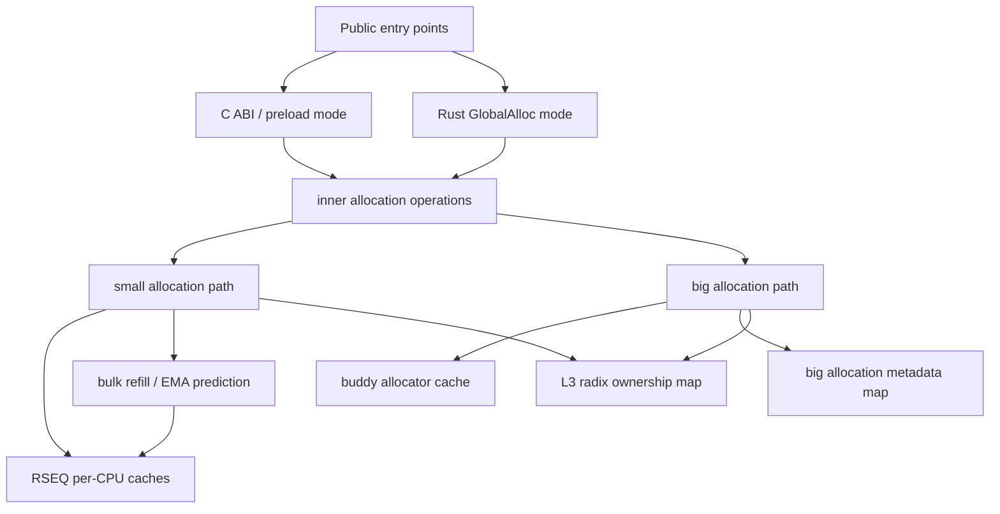
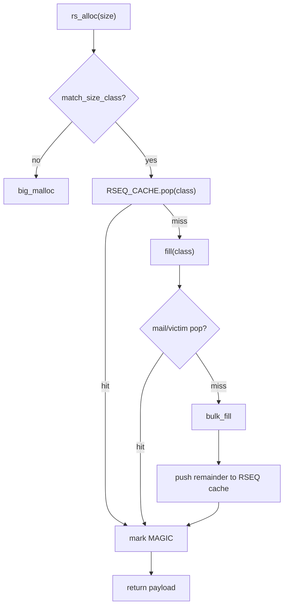
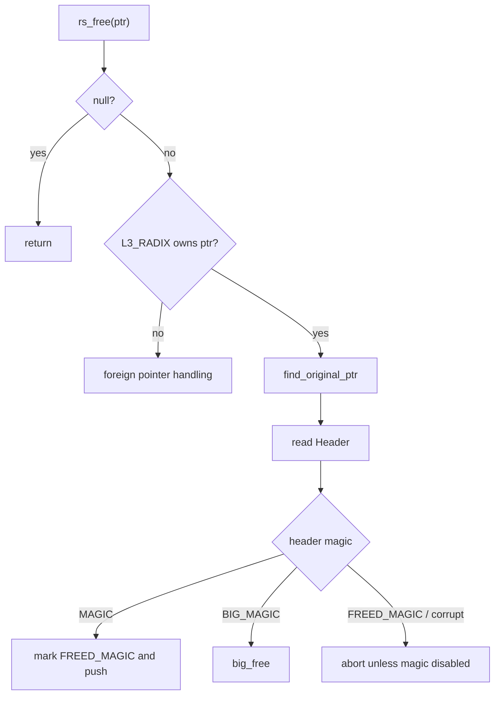
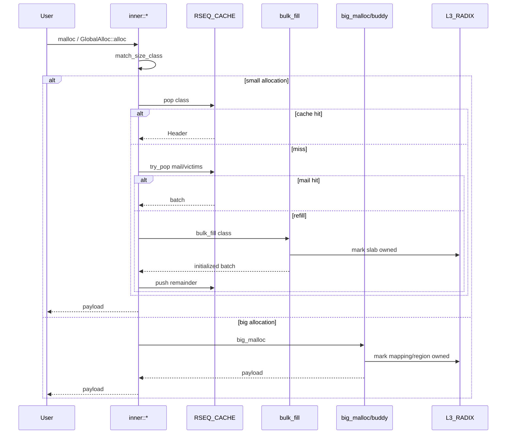

# RSMalloc Architecture

This document is a working architecture draft for `rsmalloc` `0.1.0-alpha`. It describes the allocator as it exists today, not as a final stable design. Some pieces are intentionally experimental and may change before a production-ready release.

## Design Goal

`rsmalloc` is built around a simple idea:

> Allocation ownership is temporary and follows the hot CPU cache, not the thread or the original allocation source.

For small allocations, the allocator uses Linux Restartable Sequences (RSEQ) to manipulate CPU-local caches with very little synchronization overhead. Larger allocations use a separate mapping/buddy path because they have different locality, metadata, and trimming requirements.

## High-Level Layout



Main source areas:

| Area | Role |
| --- | --- |
| `src/abi` | C ABI entry points for `LD_PRELOAD` builds. |
| `src/global_alloc.rs` | Rust `GlobalAlloc` integration, Rust-facing configuration, capabilities, stats, and direct helper methods. |
| `src/inner` | Shared allocation operations: alloc, free, realloc, calloc, alignment, fallback/free handling. |
| `src/rseq_core` | RSEQ cache layout, inline assembly critical sections, bulk refill metadata, RSEQ TLS access. |
| `src/big_allocations` | Big allocation path and buddy allocator. |
| `src/internals` | Radix ownership map, big allocation map, locks, once primitives, env parsing. |
| `src/core_prim` | Bootstrap, fork handling, predictor state, raw RSEQ registration fallback, pointer wrappers. |
| `src/utility.rs` | Size classes, refill targets, lookup tables, shared helpers. |

## Allocation Classes

Small allocations are size-classed up to `2 MiB`.

Current size classes live in `src/utility.rs` and are grouped approximately as:

- tiny: `16`, `32`, `48`, `64`, `80`, `96`, `128`
- small: `160`, `192`, `256`, `320`, `384`, `512`
- medium: `768`, `1024`, `1280`, `1536`, `1792`, `2048`, `2560`, `3072`
- larger small/slab classes: `3840`, `4096`, `8192`, `12288`, `16384`, `24576`, `32768`, ... up to `2097152`

`match_size_class(size)` uses a fast LUT for sizes `<= 4096` and a simple slow scan above that. A request of size `0` or above the largest small class falls through to the big allocation path.

Each allocated block has a `Header` placed before the returned payload. Header layout is deliberately constrained because the RSEQ assembly and list operations depend on `Header::next` being where the list code expects it.

## Bootstrap

Initialization differs slightly between preload and Rust global allocator modes, but both set up the same core allocator state.

Bootstrap initializes:

1. RSEQ availability:
   - normally via libc-provided RSEQ TLS symbols,
   - optionally via raw registration when `legacy-glibc-support` is enabled.
2. Runtime knobs:
   - `RS_MAX_REFILL_RETRIES`,
   - `RS_EMA_ALPHA`,
   - `RS_PREDICTOR_INIT_BATCH`,
   - buddy cache size / THP / trim options in preload mode.
3. `L3_RADIX`, the ownership map.
4. `RSEQ_CACHE`, the per-CPU cache array.
5. `BIG_BUDDY_ALLOCATOR`, when configured.
6. Fork handlers for preload/fallback state.
7. Randomized magic values and aligned-allocation tag, unless randomization is explicitly disabled.
8. Optional canary seed when `canary` is enabled.

In non-preload Rust mode, this is driven through `RSMalloc::init()` from `global_alloc.rs`. In preload mode, C ABI entry points bootstrap on first use.

## Small Allocation Fast Path

The fast path for a small allocation is:



Important details:

- The hot path tries `RSEQ_CACHE.pop(class)` first.
- RSEQ pop/push uses inline assembly critical sections.
- If the thread is migrated or preempted inside an RSEQ critical section, the kernel aborts the sequence and control jumps to the abort handler.
- After a few RSEQ aborts, code falls back to mailbox paths rather than spinning forever.
- The per-CPU `usage` counter is an approximate pressure signal, not exact accounting. Stale-low drift is preferred over stale-high drift because stale-high pushes too much traffic into mailboxes.

## RSEQ Cache Layout

`RSEQ_CACHE` owns an mmap-backed array of `MainCache`, one per configured CPU plus one extra overflow/fallback slot. With the default `rseq-thread-failure-fallback` feature, invalid or unregistered RSEQ CPU IDs use that extra slot instead of indexing CPU-local state directly.

```rust
#[repr(C, align(4096))]
pub struct MainCache {
    cache: [ClassCache; NUM_SIZE_CLASSES],
    mail: [SelfMail; NUM_SIZE_CLASSES],
    #[cfg(feature = "cpu-refill-paths")]
    bulk_fill: [CPUBulkClass; NUM_SIZE_CLASSES],
}
```

The 4096-byte alignment is intentional. It keeps each CPU's cache structure page-separated, which reduces false-sharing risk and leaves room for future NUMA-aware policy.

### `ClassCache`

`ClassCache` is the primary per-CPU freelist for one size class:

- `list`: RSEQ-managed linked list of free `Header`s.
- `usage`: approximate pressure counter.

### `SelfMail`

`SelfMail` is the overflow and fallback queue for one CPU/class pair:

- used when a per-CPU cache is over pressure limits,
- used when RSEQ retry count is exceeded,
- used by victim stealing when the local CPU has no cached block,
- used by thread-exit pending refill drain in the default thread-local refill path,
- used by the default RSEQ thread-failure fallback when the kernel/libc reports an invalid CPU ID.

The mail list uses an ABA-tagged pointer word. It is still a fallback/pressure path, not the ideal hot allocation path.

`SelfMail` is expected to remain fast enough for overflow, fallback, and occasional cross-CPU recovery. Normal traffic should mostly hit the RSEQ cache, but occasional mail usage should not meaningfully slow the allocator down. If a workload spends a large fraction of time in `SelfMail`, that usually points to refill pressure, cache sizing, migration, or workload shape rather than `SelfMail` being intrinsically too slow.

## Refill Path

When RSEQ cache and mailbox/victim stealing cannot satisfy an allocation, `fill()` calls `refill()`, which calls `bulk_fill()`.

`bulk_fill()` maps a slab-like chunk:

```text
[ MetaData ][ Header + payload ][ Header + payload ] ...
```

`MetaData` tracks:

- mapping start,
- mapping end,
- next uninitialized block position.

Blocks are initialized lazily in batches. The initialized batch is returned to allocation code, one block is used immediately, and the remainder is pushed into the per-CPU RSEQ cache.

### Thread-Local Pending Metadata

Default refill behavior uses thread-local pending metadata:

- if a mapped slab has uninitialized blocks left after a refill batch, the leftover `MetaData` is stored in `THREAD_BULK.free[class]`,
- the next refill for the same thread/class continues initializing from that pending metadata,
- unless `disable-thread-pending` is enabled, a TLS destructor drains pending metadata at thread exit by initializing the remaining blocks and pushing them back through the normal guarded RSEQ cache push path.

This model avoids a shared refill lock on the default path while reducing stranded pending refill state when threads exit.

### Optional Per-CPU Refill Metadata

With `cpu-refill-paths`, pending refill metadata is stored per CPU/class in `MainCache.bulk_fill` behind a `SerialLock`.

This can improve some locality/retention patterns but can also create lock convoy behavior when many threads refill the same class on the same CPU at the same time. It is experimental and should be benchmarked per workload.

## EMA Refill Prediction

Small refill sizes are adaptive instead of fixed. The goal is to avoid two bad extremes:

- refilling too little, which causes repeated slow-path trips and extra RSEQ/mailbox traffic,
- refilling too much, which increases virtual-memory retention, cache/TLB pressure, and cross-CPU spillover.

There are two independent thread-local, per-size-class predictors:

- `PREDICTOR`: predicts how many blocks allocation code should try to pull from cache/mail/victim sources before returning one block to the caller and pushing the rest locally.
- `BULK_FILL_PREDICTOR`: predicts how many blocks a fresh or pending bulk-fill slab should initialize at once.

They are separate because the two costs are different. Pulling already-initialized blocks mostly changes cache pressure and local freelist depth; initializing from bulk metadata touches fresh memory, writes headers, computes canaries when enabled, and may expose more mapped pages to the working set.

Current predictor state is intentionally small:

```rust
struct Predictor {
    ema: f32,
    batch: usize,
    once: Once,
    is_fill: bool,
    _class: usize,
}
```

The predictor is initialized lazily on first use. Normal cache/mail prediction starts from `PREDICTOR_INIT_BATCH` (`RS_PREDICTOR_INIT_BATCH` in runtime config paths). Bulk-fill prediction starts from `BULK_FILL_PREDICTOR_INIT_BATCH`. `EMA_ALPHA` controls responsiveness and currently defaults to `0.15`.

The update rule is the standard exponential moving average:

```text
ema_next = alpha * observed_demand + (1 - alpha) * ema_old
batch_next = ceil(ema_next).clamp(1, ITERATIONS[class])
```

`ITERATIONS[class]` is the hard per-class maximum derived from refill target bytes and block size. This keeps predictor output bounded even if a workload keeps asking for more.

### Observed Demand

The predictor does not observe application allocation demand directly. It observes what the allocator managed to obtain during a refill step:

- if only a few blocks were available, the observation is small and future batches shrink gradually,
- if the requested batch was fully satisfied, that is treated as a signal that demand may be at least as large as the request.

The second case matters because a plain EMA can get stuck too low. Example: if `batch == 8` and every refill gets exactly 8 blocks, feeding `8` back into the EMA forever never lets the predictor discover that the workload could use `16`, `32`, or more.

To avoid that, when a refill returns exactly the requested batch and the class still has headroom, the observed value is lifted by `+25%` before updating the EMA:

```text
if returned == requested && requested < ITERATIONS[class]:
    observed = min(requested + max(requested / 4, 1), ITERATIONS[class])
else:
    observed = returned
```

This is deliberately conservative. It lets the predictor climb out of too-small batches during sustained pressure, but avoids doubling into large over-refills after one successful refill.

### Why EMA Instead Of Instant Batch Changes?

Refill behavior is noisy:

- RSEQ aborts and mailbox pressure can make one refill look artificially small,
- victim/mail hits can temporarily hide true demand,
- bursty workloads may allocate heavily for a short phase and then stop,
- thread migration means CPU-local cache state is not a perfect demand signal.

EMA smooths those transient observations. With `alpha = 0.15`, recent refill results matter, but one odd refill does not immediately rewrite the batch size. The tradeoff is that the predictor reacts over multiple refill calls rather than instantly.

### Debugging Prediction Quality

Debug features provide approximate and exact prediction miss accounting:

- `debug` gives low-overhead approximate over/under-prediction counters suitable for normal benchmark runs,
- `debug-predictor-exact` probes more aggressively to classify misses more accurately and is higher overhead,
- `predictor-debug` can print predictor batch choices for direct inspection.

The counters should be interpreted as tuning signals, not correctness requirements. Under-prediction usually means more refill trips. Over-prediction usually means more retained/free cached memory. The right balance depends on workload locality and whether the benchmark is latency-, throughput-, RSS-, or TLB-sensitive.

### Current Limitations

- Predictors are thread-local, not global. This avoids atomics on the hot path but means new threads start from initial settings.
- The predictor sees allocator-side refill results, not future application demand.
- The `+25%` uplift helps sustained full-batch pressure, but it is still intentionally slower than an aggressive doubling strategy.
- Very synchronized refill storms can still bottleneck elsewhere, especially with experimental `cpu-refill-paths` where shared per-CPU refill metadata is lock-protected.

## Free Path

Freeing follows this shape:



After the radix ownership check, `rs_free()` calls `find_original_ptr()` before reading the header. Normal pointers pass through unchanged. Aligned allocations may return an interior aligned pointer, so `find_original_ptr()` checks for the randomized alignment tag stored just before the returned aligned address and recovers the original allocation pointer.

Rust `GlobalAlloc::dealloc` currently delegates to the normal `rs_free` path. Preload `free_sized` and `free_aligned_sized` are compatibility shims over normal `free`.

## Aligned Allocations

The alignment path overallocates enough space for:

- requested payload,
- alignment slop,
- a tag and original-pointer slot.

The returned aligned pointer has metadata immediately before it:

```text
[ original allocation ... ][ ALIGN_TAG ][ original_ptr ][ aligned payload ]
```

The tag is randomized at bootstrap unless randomization is disabled. Free/realloc/usable-size paths recover the original pointer through this tag.

## Realloc Path

`rs_realloc` handles several cases:

- `null` pointer -> allocate,
- new size `0` -> free and return null,
- aligned pointer -> allocate with observed alignment, copy, free original,
- small allocation shrinking within class -> return same pointer,
- small allocation growing within class -> return same pointer,
- small allocation growing across classes -> allocate/copy/free,
- large small-class slab mappings may try in-place `mremap` when mapping shape allows,
- direct big allocations may try in-place `mremap`,
- buddy-backed big allocations may try in-place buddy growth before falling back to allocate/copy/free.

## Big Allocation Path

Requests that do not match a small size class use `big_malloc()`.

Big allocation behavior:

1. Add `Header::SIZE`.
2. Align mapping size to 4096, or to 2 MiB when close enough and THP is enabled.
3. If buddy allocator is initialized and the original request is `<= 64 MiB`, try `BIG_BUDDY_ALLOCATOR`; internally the buddy path rounds up to at least the `4 MiB` minimum order.
4. Otherwise mmap directly.
5. Write a `BIG_MAGIC` header.
6. Record metadata in the big allocation map keyed by payload pointer.
7. Mark ownership in `L3_RADIX`.

Direct big allocations are unmapped on free. Buddy allocations are returned to the buddy pool.

## Buddy Allocator

The buddy allocator caches large regions for big allocations.

Current range:

- min order: `22` (`4 MiB`),
- max order: `26` (`64 MiB`).

Each region has:

- region metadata,
- base address and total size,
- free lists for each order,
- a region lock,
- a trim lock.

Allocation finds a large enough block, splitting higher-order blocks as needed. Freeing coalesces with free buddies where possible.

`trim(requested_size)` uses `madvise(MADV_DONTNEED)` on free buddy blocks. `requested_size == 0` means trim all currently free buddy blocks; nonzero requests trim until at least the requested byte target is reached or no more eligible free blocks remain. The trim path holds `trim_lock` and region lock so allocation/free do not race with page advice over the same free lists.

## Ownership Tracking: `L3_RADIX`

`L3_RADIX` is the allocator ownership map. It answers: "does this address look owned by rsmalloc?"

Uses:

- distinguish rsmalloc pointers from foreign pointers,
- decide whether free/realloc/usable-size should use internal logic or fallback/abort,
- mark small slab mappings,
- mark direct and aligned big mappings,
- mark buddy regions.

The radix implementation is a lazy multi-level bitmap tree covering the low canonical 56-bit user address range used on x86-64 LA57 systems. It uses 4 KiB chunks, an 8-bit top level, two 12-bit pointer levels, and a 12-bit bitmap leaf. Range marking validates overflow and bounds explicitly instead of wrapping indices.

The radix implementation uses acquire/release atomics for reader/writer synchronization. Writers mutate under `SerialLock` and publish new radix nodes or bitmap updates with release operations; readers use acquire loads and may observe either the old or new ownership state during a race. The allocator only requires eventual visibility here, not a perfectly up-to-date ownership snapshot.

## Public Modes

### Preload Mode

Enabled with `preload` feature.

Provides C ABI symbols such as:

- `malloc`, `calloc`, `free`, `realloc`,
- `reallocarray`, `recallocarray`,
- `posix_memalign`, `memalign`, `aligned_alloc`, `valloc`, `pvalloc`,
- `malloc_usable_size`,
- `malloc_trim`,
- sized-free compatibility shims.

Foreign pointers can fall back to libc behavior in preload mode where fallback support is compiled.

### Rust Global Allocator Mode

Default non-preload mode exposes:

- `RSMalloc`,
- `RSMallocConfig`,
- `GlobalAlloc` implementation,
- raw helper methods (`rs_malloc`, `rs_free`, `rs_realloc`, etc.),
- capabilities snapshot,
- debug stats when enabled.

Foreign pointer behavior is configured through `ForeignPointerSettings`; global allocator mode defaults toward aborting on foreign pointers unless configured otherwise.

## Feature Flags

Important architecture-affecting features:

| Feature | Effect |
| --- | --- |
| `preload` | Builds C ABI / preload support. |
| `rseq-thread-failure-fallback` | Enables the default overflow-slot recovery path for invalid/unregistered RSEQ CPU IDs. |
| `legacy-glibc-support` | Enables raw RSEQ fallback when libc RSEQ symbols are unavailable. |
| `canary` | Enables header canary checks. |
| `extended-header` | Uses wider metadata and implies `canary`. |
| `debug` | Enables low-overhead stats/debug counters. |
| `debug-exact` | Adds exact global lock counters and debug printing. |
| `debug-predictor-exact` | Uses higher-overhead exact refill prediction miss accounting. |
| `cpu-refill-paths` | Uses per-CPU shared pending refill metadata. Experimental. |
| `disable-thread-pending` | Disables default thread-exit drain of thread-local pending refill metadata. |

## Known Architectural Tradeoffs

- The small allocation fast path is optimized around CPU-locality and RSEQ, not thread ownership.
- Victim stealing currently scans CPU mailboxes and is intentionally simple.
- The extra RSEQ cache slot is reserved for fallback/overflow handling, not normal CPU-local traffic.
- `SelfMail` is a relief valve and fallback path; too much traffic there usually means refill/capacity pressure should be inspected.
- Per-CPU refill metadata can help some real workloads but can convoy on synchronized refill storms.
- The big allocation map is an internal hashmap and is planned for future replacement.
- Buddy trimming uses `madvise`, not `munmap`, so it returns physical pressure to the kernel while keeping the virtual region structure.

## Allocation Lifecycle Summary



## Things To Verify / Review

This draft intentionally leaves a few review points explicit:

- whether the thread-local destructor model for pending refill drain is final,
- whether `cpu-refill-paths` should remain experimental-only for alpha,
- whether the current size class set and refill byte targets are final enough to document as stable,
- whether buddy trim should be documented as API-stable or explicitly experimental.
