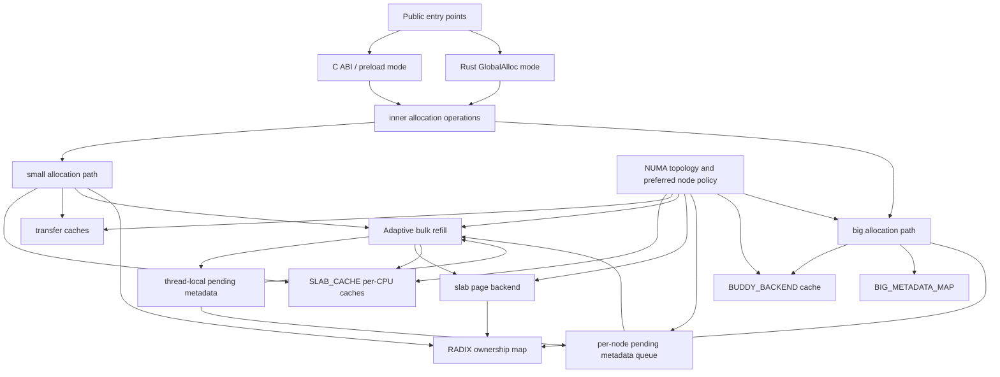
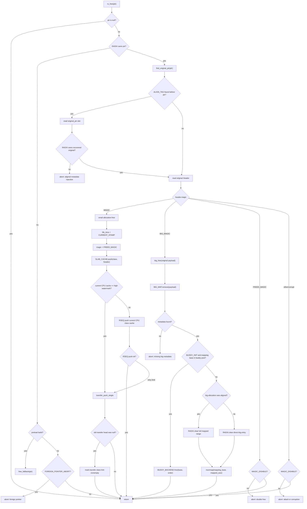

# RSMalloc Architecture

This document is a working architecture draft for `rsmalloc` `0.2.0-alpha`. It describes the allocator as it exists today, not as a final stable design. Some pieces are intentionally experimental and may change before a production-ready release.

`0.2.0-alpha` is a full allocator-architecture overhaul relative to the `main` branch's earlier `0.1.0-alpha` design. The release reworks the RSEQ slab cache, transfer-cache balancing, bulk-refill metadata ownership, NUMA placement, buddy backend, trimming/relief paths, preload ABI behavior, benchmark suite, and public Rust configuration surface.

## Design Goal

`rsmalloc` is built around a simple idea:

> Allocation ownership is temporary and follows the hot CPU cache, not the thread or the original allocation source.

For small allocations, the allocator uses Linux Restartable Sequences (RSEQ) to manipulate CPU-local slab caches with very little synchronization overhead. Transfer caches, per-node pending metadata queues, and adaptive bulk refill handle overflow, cross-CPU reuse, and lazy header initialization. Larger allocations use a separate mapping/buddy-backend path because they have different locality, metadata, and trimming requirements.

## High-Level Layout


```mermaid
flowchart TD
    API[Public entry points]
    ABI[C ABI / preload mode]
    GLOBAL[Rust GlobalAlloc mode]
    INNER[inner allocation operations]
    SMALL[small allocation path]
    RSEQ[SLAB_CACHE per-CPU caches]
    TRANSFER[transfer caches]
    REFILL[Adaptive bulk refill]
    PAGE[slab page backend]
    PENDING[per-node pending metadata queue]
    TLS[thread-local pending metadata]
    NUMA[NUMA topology and preferred node policy]
    BIG[big allocation path]
    BUDDY[BUDDY_BACKEND cache]
    RADIX[RADIX ownership map]
    MAP[BIG_METADATA_MAP]

    API --> ABI
    API --> GLOBAL
    ABI --> INNER
    GLOBAL --> INNER
    INNER --> SMALL
    INNER --> BIG
    SMALL --> RSEQ
    SMALL --> TRANSFER
    SMALL --> REFILL
    REFILL --> TLS
    REFILL --> PAGE
    TLS --> REFILL
    TLS --> PENDING
    PENDING --> REFILL
    REFILL --> RSEQ
    PAGE --> RADIX
    NUMA --> RSEQ
    NUMA --> TRANSFER
    NUMA --> REFILL
    NUMA --> PAGE
    NUMA --> PENDING
    NUMA --> BUDDY
    NUMA --> BIG
    BIG --> BUDDY
    BIG --> MAP
    SMALL --> RADIX
    BIG --> RADIX
```

Main source areas:

| Area | Role |
| --- | --- |
| `src/abi` | C ABI entry points for `LD_PRELOAD` builds. |
| `src/global_alloc.rs` | Rust `GlobalAlloc` integration, Rust-facing configuration, capabilities, stats, and direct helper methods. |
| `src/inner` | Shared allocation operations: alloc, free, realloc, calloc, alignment, fallback/free handling. |
| `src/rseq_core` | `SLAB_CACHE` layout, transfer caches, nonempty transfer hints, inline assembly critical sections, bulk refill metadata, pending queue, RSEQ TLS access. |
| `src/backend` | Slab page backend arenas used by bulk refill metadata allocation. |
| `src/big_allocations` | Big allocation path and NUMA-aware `BUDDY_BACKEND`, including cached-region reuse, trimming, and relief integration. |
| `src/internals` | `RADIX` ownership map, `BIG_METADATA_MAP`, NUMA parsing/binding helpers, locks, once primitives, env parsing. |
| `src/core_prim` | Bootstrap, fork handling, predictor state, pointer wrappers. |
| `src/utility.rs` | Size classes, refill targets, lookup tables, shared helpers. |

## Allocation Classes

Small allocations are size-classed up to `2 MiB`.

Current size classes live in `src/utility.rs` and are grouped approximately as:

- tiny: `16`, `32`, `48`, `64`, `80`, `96`, `128`
- small: `160`, `192`, `256`, `320`, `384`, `512`
- medium: `768`, `1024`, `1280`, `1536`, `1792`, `2048`, `2560`, `3072`
- larger small/slab classes: `3840`, `4096`, `8192`, `12288`, `16384`, `24576`, `32768`, ... up to `2097152`

`match_size_class(size)` uses a fast LUT for sizes `<= 4096` and a simple slow scan above that. A request of size `0` maps to the smallest class. Requests above the largest small class fall through to the big allocation path.

Each allocated block has a `Header` placed before the returned payload. Header layout is deliberately constrained because the RSEQ assembly and list operations depend on `Header::next` being where the list code expects it.

## Bootstrap

Initialization differs slightly between preload and Rust global allocator modes, but both set up the same core allocator state.

Bootstrap initializes:

1. RSEQ availability through libc-provided RSEQ TLS state.
2. Runtime knobs:
   - `RS_ARENA_SIZE`,
   - `RS_MAX_REFILL_RETRIES`,
   - `RS_PREDICTOR_INIT_BATCH`,
   - buddy cache size / THP / trim options in preload mode.
3. `RADIX`, the ownership map.
4. `SLAB_CACHE`, the per-CPU cache array, transfer caches, and NUMA topology snapshot.
5. `PENDING_QUEUE`, the per-node/per-class global pending metadata queue.
6. `BUDDY_BACKEND`, when configured.
7. Fork handlers for preload/fallback state.
8. Randomized magic values and aligned-allocation tag, unless randomization is explicitly disabled.

In non-preload Rust mode, this is driven through `RSMalloc::init()` from `global_alloc.rs`. In preload mode, C ABI entry points bootstrap on first use.

## Allocation Path

Allocation follows this shape:


```mermaid
flowchart TD
    A["rs_alloc(size, aligned)"] --> PRE{"preload build?"}
    PRE -- "yes" --> BOOT["bootstrap once"]
    PRE -- "no" --> MATCH["match_size_class(size)"]
    BOOT --> MATCH

    MATCH --> CLASS{"size class found?"}

    CLASS -- "yes" --> POP["SLAB_CACHE.pop(class)"]
    POP --> POP_RESULT{"RSEQ pop result"}
    POP_RESULT -- "class-cache hit" --> SMALL_OWN["optional check-owned-on-alloc"]
    POP_RESULT -- "RSEQ abort retries" --> POP_SINGLE["transfer_pop_single(current CPU)"]
    POP_SINGLE -- "hit" --> SMALL_OWN
    POP_SINGLE -- "empty" --> POP
    POP_RESULT -- "empty class cache" --> FILL["fill(class)"]

    FILL --> PRED["cache predictor chooses batch"]
    PRED --> TRYPOP["SLAB_CACHE.try_pop(class, batch, cpu)"]
    TRYPOP --> LOCAL["pop local transfer cache"]
    LOCAL --> LOCAL_HIT{"local transfer hit?"}
    LOCAL_HIT -- "yes" --> UPDATE_CACHE["update cache predictor"]
    LOCAL_HIT -- "no" --> SAME_NODE["scan same-node class hint bitmap"]
    SAME_NODE --> SAME_HIT{"same-node victim hit?"}
    SAME_HIT -- "yes" --> STEAL["record transfer steal if debug"]
    STEAL --> UPDATE_CACHE
    SAME_HIT -- "no" --> NUMA{"NUMA enabled?"}
    NUMA -- "yes" --> REMOTE["scan remote node class hint bitmaps"]
    REMOTE --> REMOTE_HIT{"remote victim hit?"}
    REMOTE_HIT -- "yes" --> STEAL
    REMOTE_HIT -- "no" --> DRY["record dry steal if debug"]
    NUMA -- "no" --> DRY
    DRY --> REFILL["refill(class, cpu)"]

    REFILL --> RETRY{"under MAX_REFILL_RETRIES?"}
    RETRY -- "yes" --> BULK_BATCH["bulk-fill predictor chooses batch"]
    BULK_BATCH --> BULK["bulk_fill(class, cpu, bulk_batch)"]
    BULK --> TLS["check thread-local pending span"]
    TLS --> TLS_OK{"remaining blocks?"}
    TLS_OK -- "yes" --> INIT["lazy initialize requested headers"]
    TLS_OK -- "no or no span" --> META["alloc_metadata(class, block_size, cpu)"]

    META --> NODE["select node for current CPU"]
    NODE --> PENDING["PENDING_QUEUE.pop(node, class)"]
    PENDING --> PENDING_HIT{"pending span found?"}
    PENDING_HIT -- "yes" --> INIT
    PENDING_HIT -- "no" --> SIZE["compute page-rounded metadata span"]
    SIZE --> PAGE_INIT["PAGE_ALLOCATOR.init(numa ranges)"]
    PAGE_INIT --> PAGE_ALLOC["PAGE_ALLOCATOR.allocate: bump, bitmap, or new arena"]
    PAGE_ALLOC --> PAGE_OK{"span allocated?"}
    PAGE_OK -- "no" --> BULK_ERR["bulk_fill returns OutOfMemory"]
    PAGE_OK -- "yes" --> ARENA_ADV{"new arena advice feature?"}
    ARENA_ADV -- "only no-huge" --> NOHUGE["madvise arena no huge page"]
    ARENA_ADV -- "only huge" --> HUGE["madvise arena huge page"]
    ARENA_ADV -- "none or both" --> ACCOUNT["add_slab_cached_va(total)"]
    NOHUGE --> ACCOUNT
    HUGE --> ACCOUNT
    ACCOUNT --> MARK_SPAN["RADIX.set_range(span, total, true)"]
    MARK_SPAN --> WRITE_META["write MetaData"]
    WRITE_META --> INIT

    INIT --> COUNT{"initialized count > 0?"}
    COUNT -- "no" --> BULK_ERR
    COUNT -- "yes" --> LEFT{"span has remaining blocks?"}
    LEFT -- "yes" --> SAVE_TLS["save span in THREAD_BULK.free[class]"]
    LEFT -- "no" --> BULK_OK["bulk_fill returns batch"]
    SAVE_TLS --> BULK_OK
    BULK_OK --> UPDATE_BULK["update bulk-fill predictor"]
    UPDATE_BULK --> TAKE["take one block from batch"]
    BULK_ERR --> RETRY_NEXT{"retry again?"}
    RETRY_NEXT -- "yes" --> RETRY
    RETRY_NEXT -- "no" --> FINAL_POP["final one-block SLAB_CACHE.try_pop"]
    RETRY -- "no" --> FINAL_POP
    FINAL_POP --> FINAL_HIT{"got block?"}
    FINAL_HIT -- "yes" --> SMALL_OWN
    FINAL_HIT -- "no" --> SMALL_NULL["return null; preload sets nomem"]

    UPDATE_CACHE --> TAKE
    TAKE --> REST{"batch count > 1?"}
    REST -- "yes" --> PUSH_REST["push remainder via SLAB_CACHE.push_tailed"]
    REST -- "no" --> SMALL_OWN
    PUSH_REST --> SPILL_REST{"cache high or RSEQ push_tailed abort?"}
    SPILL_REST -- "yes" --> TRANSFER_BATCH["transfer_push_batch and mark hint if needed"]
    SPILL_REST -- "no" --> SMALL_OWN
    TRANSFER_BATCH --> SMALL_OWN
    SMALL_OWN --> STAMP["stamp MAGIC and ALLOCATED_FLAG"]
    STAMP --> SMALL_RET["return small payload"]

    CLASS -- "no" --> BIG["big_malloc(size, aligned)"]
    BIG --> CHECK_ADD{"size + Header::SIZE ok?"}
    CHECK_ADD -- "no" --> BIG_NULL["return null"]
    CHECK_ADD -- "yes" --> ALIGN["estimate and align mapping size"]
    ALIGN --> BIG_NODE["select current CPU NUMA node"]
    BIG_NODE --> BUDDY_ELIG{"buddy enabled and size <= 64 MiB?"}
    BUDDY_ELIG -- "yes" --> BUDDY_ALLOC["BUDDY_BACKEND.alloc(local node first)"]
    BUDDY_ALLOC --> BUDDY_HIT{"buddy hit?"}
    BUDDY_HIT -- "yes" --> BUDDY_FLAG["set zero/trim/reuse flag from buddy state"]
    BUDDY_HIT -- "no" --> DIRECT
    BUDDY_ELIG -- "no" --> DIRECT["direct mmap"]
    DIRECT --> MMAP_OK{"mmap ok?"}
    MMAP_OK -- "no" --> BIG_NULL
    MMAP_OK -- "yes" --> PREFER["prefer current NUMA node if NUMA"]
    PREFER --> ZERO_FLAG["flag = ZERO_FLAG"]
    ZERO_FLAG --> BIG_THP{"eligible for direct THP request?"}
    BIG_THP -- "yes" --> BIG_HUGE["madvise huge page"]
    BIG_THP -- "no" --> BIG_HEADER
    BIG_HUGE --> BIG_HEADER
    BUDDY_FLAG --> BIG_HEADER["write BIG_MAGIC header"]
    BIG_HEADER --> BIG_RADIX{"buddy backed?"}
    BIG_RADIX -- "yes" --> BIG_MAP["BIG_MAP.insert(payload metadata)"]
    BIG_RADIX -- "no, normal direct" --> BIG_SINGLE["RADIX.set_single_big"]
    BIG_RADIX -- "no, aligned direct" --> BIG_RANGE["RADIX.set_range(full mapping)"]
    BIG_SINGLE --> BIG_MAP
    BIG_RANGE --> BIG_MAP
    BIG_MAP --> BIG_OWN["optional check-owned-on-alloc"]
    BIG_OWN --> BIG_RET["return big payload"]
```

Important details:

- The small-allocation path tries `SLAB_CACHE.pop(class)` first for every matched size class.
- If the per-CPU class cache is empty, `fill(class)` tries transfer-cache reuse before allocating new refill memory.
- Batch transfer reuse tries the local transfer cache first, then hinted CPUs in the same NUMA range, then remote ranges when NUMA is enabled.
- RSEQ pop/push uses inline assembly critical sections. If the kernel aborts the sequence repeatedly, the pop path probes the current CPU's transfer cache before retrying.
- Bulk refill uses thread-local pending metadata, then the per-node pending queue, then `PAGE_ALLOCATOR` arenas. Headers are initialized lazily only for the requested batch.
- The per-CPU `usage` counter is an approximate pressure signal, not exact accounting. Stale-low drift is preferred over stale-high drift because stale-high pushes too much traffic into transfer caches.

## Slab Cache Layout

`SLAB_CACHE` owns an mmap-backed array of per-CPU cache state, one per configured CPU plus one extra spare slot. Current `0.2.0-alpha` treats working per-thread RSEQ state as required; invalid or unregistered RSEQ CPU IDs are not silently redirected through an allocation fallback path.

```rust
#[repr(C, align(4096))]
pub struct MainCache {
    cache: [RseqCache; NUM_SIZE_CLASSES],
    mail: [TransferCache; NUM_SIZE_CLASSES],
}
```

The 4096-byte alignment is intentional. It keeps each CPU's cache structure page-separated, which reduces false-sharing risk and leaves room for future NUMA-aware policy.

### `RseqCache`

`RseqCache` is the primary per-CPU freelist for one size class:

- `list`: RSEQ-managed linked list of free `Header`s.
- `usage`: approximate pressure counter.

### `TransferCache`

`TransferCache` is the overflow, fallback, cold-list, and medium-class reuse queue for one CPU/class pair:

- used when a per-CPU cache is over pressure limits,
- used when RSEQ retry count is exceeded,
- used by victim stealing when the local CPU has no cached block,
- used by medium-size classes before refill to avoid per-CPU cache bloat,
- used as a cold fallback for successfully trimmed small blocks.

Current layout:

```rust
pub struct TransferCache {
    pub list: AtomicUsize,
    pub trimmed: AtomicUsize,
}
```

The normal transfer list is preferred. The `trimmed` list is checked only after the normal list is empty, so the common normal-transfer hit does not touch trimmed state. Trimmed blocks are cold/opportunistic reuse: local pops can recover them, while remote victim stealing is allowed to miss trimmed-only CPUs until a later push refreshes the approximate class hint.

The transfer lists use ABA-tagged pointer words. They are still fallback/pressure paths for tiny/small hot allocations, but medium classes intentionally use transfer-cache scanning before refill. Victim scans are NUMA-aware: local CPU transfer cache is tried first, then CPUs in the same node range, then remote node ranges when NUMA is active.

Batch victim stealing is guided by a per-class nonempty bitmap. Each bitmap word tracks up to 64 CPUs for one size class. Transfer pushes set the hint only when the push observes an empty-to-nonempty transition. Transfer pops clear the hint when they observe empty transfer lists, then cheaply recheck the normal list to avoid the most important stale false-negative race on hot blocks. These bits are relaxed hints only; the ABA-tagged transfer list remains the source of correctness.

`TransferCache` is expected to remain fast enough for overflow, fallback, medium-class reuse, occasional cross-CPU recovery, and cold trimmed reuse. Normal tiny/small traffic should mostly hit the RSEQ-managed class cache, while medium traffic prefers transfer-cache reuse to avoid RSS growth from stranded per-CPU blocks.

## Refill Path

When `SLAB_CACHE` and transfer-cache/victim stealing cannot satisfy an allocation, `fill()` calls `refill()`, which calls `bulk_fill()`.

`bulk_fill()` obtains a slab-like chunk from the slab page backend:

```text
[ MetaData ][ Header + payload ][ Header + payload ] ...
```

`MetaData` tracks:

- pending queue link,
- mapping start,
- mapping end,
- next uninitialized block position,
- NUMA node id for the mapping.

Blocks are initialized lazily in batches. `bulk_fill()` writes headers only for the current adaptive `max_init` batch; any remaining address range in the metadata span is left uninitialized and tracked by `MetaData::next` for later refills. The initialized batch is returned to allocation code, one block is used immediately, and the remainder is pushed into `SLAB_CACHE`.

### Slab Page Backend

The slab page backend serves fresh bulk-fill metadata spans from larger NUMA-preferred arenas instead of issuing a direct mapping for every refill span. It is a hybrid allocator: it tries cheap bump allocation from the current node arena first, then scans arena bitmaps for reusable free page runs, then maps a new arena if needed. This reduces `mmap` call count, VMA churn, and scattered refill mappings while giving the allocator a central place to manage slab backing memory.

The arena data-size minimum defaults to 256 MiB. Rust `GlobalAlloc` configurations provide it through `RSMallocConfig::arena_min_size`; preload initialization reads `RS_ARENA_SIZE` as a byte count. Arena creation uses the larger of this minimum and the current refill request, then aligns the result to the page size. The mapping reserves virtual address space; physical RSS remains driven primarily by pages touched during lazy refill initialization and by the selected THP policy.

Each page-backend arena stores its `PageArena` metadata and bitmap at the front of the mapping, then exposes a page-aligned data region for refill spans:

```text
[ PageArena ][ bitmap ][ padding ][ page-aligned refill span memory ... ]
```

The bitmap is protected by the per-node page-backend lock and is intentionally not atomic. Bump allocations mark bitmap bits too, so bitmap reuse, in-place growth, and future release logic share one page-run ownership model. The current `release(...)` API is scaffolding for future span reclaim; it is not part of normal slab free yet because safe reclaim needs span live-count policy.

`try_grow_inplace(...)` can extend a page-backed refill span when the following pages in the same arena are still free. `small_realloc` uses this only for single-block slab refill spans; normal shrink keeps the existing block, and failed growth falls back to allocate/copy/free.

`RADIX` ownership and cached-VA accounting are still applied to the allocated metadata span rather than treating every byte of arena slack as live allocation ownership. This means the backend may reserve larger virtual arenas while physical RSS remains driven by lazily initialized/touched refill pages.

The optional Cargo feature `page-backend-no-huge-page` applies Linux no-huge-page advice to these page-backend arenas. It is intended for systems that aggressively promote transparent huge pages, where slab arena slack can make RSS look much larger than expected. Enabling it can reduce RSS substantially, but may increase TLB pressure because the arenas are backed by normal pages. The opposite `page-backend-huge-page` feature requests huge-page advice for TLB-sensitive experiments when `page-backend-no-huge-page` is not also enabled; enabling both advice features intentionally results in no explicit page-backend THP advice.

### Thread-Local Pending Metadata

Default refill behavior uses thread-local pending metadata:

- if a mapped slab has uninitialized blocks left after a refill batch, the leftover `MetaData` is stored in `THREAD_BULK.free[class]`,
- the next refill for the same thread/class continues initializing headers from that pending metadata instead of mapping immediately,
- `ThreadBulk::get_or_init(class)` lazily registers the thread cleanup hook on first refill use,
- a thread-exit destructor drains pending metadata into the global pending queue so another thread on the same NUMA node can continue initializing it later.

The cleanup hook is intentionally off the allocation hot path after first touch. It registers a low-level thread-exit callback for the TLS destructor slot because raw `#[thread_local]` storage is used for allocator state.

This model avoids a shared refill lock on the hot path while reducing stranded pending refill state when threads exit.

### Global Pending Metadata Queue

`PENDING_QUEUE` is a global lock-free Treiber stack of pending `MetaData` pages, indexed by NUMA node and size class:

```text
[node_id][class] -> MetaData stack
```

The queue is initialized during `SLAB_CACHE` setup from the parsed NUMA topology. On non-NUMA systems, all traffic uses node slot `0`. On NUMA systems, each `MetaData` carries its original `node_id`, thread-exit drain pushes to that node's stack, and `alloc_metadata()` only pops from the current CPU's local node before mapping fresh memory.

Queue heads are ABA-tagged in the low 12 bits. This relies on `MetaData` being placed at the base of an mmap-backed page-aligned mapping. The queue is a cold/slow refill structure, not part of the normal RSEQ block pop/push path.

## Adaptive Refill Prediction

Small refill sizes are adaptive instead of fixed. The goal is to avoid two bad extremes:

- refilling too little, which causes repeated slow-path trips and extra RSEQ/transfer-cache traffic,
- refilling too much, which increases virtual-memory retention, cache/TLB pressure, and cross-CPU spillover.

There are two independent thread-local, per-size-class predictors:

- `PREDICTOR`: predicts how many blocks allocation code should try to pull from class-cache/transfer/victim sources before returning one block to the caller and pushing the rest locally.
- `BULK_FILL_PREDICTOR`: predicts how many blocks a fresh or pending bulk-fill slab should initialize at once.

They are separate because the two costs are different. Pulling already-initialized blocks mostly changes cache pressure and local freelist depth; initializing from bulk metadata touches fresh memory, writes headers, and may expose more mapped pages to the working set.

Current predictor state is intentionally small:

```rust
struct Predictor {
    batch: usize,
    low_count: u8,
    once: Once,
    is_fill: bool,
    _class: usize,
}
```

The predictor is initialized lazily on first use. Normal class-cache/transfer prediction starts from `PREDICTOR_INIT_BATCH` (`RS_PREDICTOR_INIT_BATCH` in runtime config paths). Bulk-fill prediction starts from `BULK_FILL_PREDICTOR_INIT_BATCH`.

The update rule is integer-only. If observed demand exceeds the current batch, the predictor grows immediately by roughly 1.5x or to the observed demand, whichever is larger. If observed demand stays below one quarter of the current batch for several refill observations, the predictor halves the batch.

```text
if observed > batch:
    batch = max(batch + batch / 2, observed).clamp(1, ITERATIONS[class])
else if observed * 4 < batch for 4 refill observations:
    batch = (batch / 2).clamp(1, ITERATIONS[class])
```

`ITERATIONS[class]` is the hard per-class maximum derived from refill target bytes and block size. This keeps predictor output bounded even if a workload keeps asking for more.

### Observed Demand

The predictor does not observe application allocation demand directly. It observes what the allocator managed to obtain during a refill step:

- if only a few blocks were available, the observation is small and future batches shrink gradually,
- if the requested batch was fully satisfied, that is treated as a signal that demand may be at least as large as the request.

The second case matters because feeding the exact returned count back forever can keep the predictor stuck too low. Example: if `batch == 8` and every refill gets exactly 8 blocks, feeding `8` back forever never lets the predictor discover that the workload could use larger batches.

To avoid that, when a refill returns exactly the requested batch and the class still has headroom, the observed value is lifted by `+25%` before updating the predictor:

```text
if returned == requested && requested < ITERATIONS[class]:
    observed = min(requested + max(requested / 4, 1), ITERATIONS[class])
else:
    observed = returned
```

This is deliberately conservative. It lets the predictor climb out of too-small batches during sustained pressure, but avoids doubling into large over-refills after one successful refill.

### Why Gradual Shrink Instead Of Instant Batch Changes?

Refill behavior is noisy:

- RSEQ aborts and transfer-cache pressure can make one refill look artificially small,
- victim/transfer hits can temporarily hide true demand,
- bursty workloads may allocate heavily for a short phase and then stop,
- thread migration means CPU-local cache state is not a perfect demand signal.

The predictor grows quickly on clear pressure because under-refilling causes repeated slow-path trips. It shrinks only after repeated low-demand observations so one odd refill does not immediately collapse the batch size.

### Debugging Prediction Quality

Debug features provide approximate and exact prediction miss accounting:

- `debug` gives low-overhead approximate over/under-prediction counters suitable for normal benchmark runs,
- `debug-predictor-exact` probes more aggressively to classify misses more accurately and is higher overhead,
- `predictor-debug` can print predictor batch choices for direct inspection.

The counters should be interpreted as tuning signals, not correctness requirements. Under-prediction usually means more refill trips. Over-prediction usually means more retained/free cached memory. The right balance depends on workload locality and whether the benchmark is latency-, throughput-, RSS-, or TLB-sensitive.

### Current Limitations

- Predictors are thread-local, not global. This avoids atomics on the hot path but means new threads start from initial settings.
- The predictor sees allocator-side refill results, not future application demand.
- The `+25%` uplift helps sustained full-batch pressure, while 1.5x growth avoids jumping as aggressively as a doubling strategy.
- Very synchronized refill storms can still bottleneck in the refill path, but pending refill metadata stays thread-local by default to avoid shared refill locks.

## Free Path

Freeing follows this shape:


```mermaid
flowchart TD
    A["rs_free(ptr)"] --> NULL{"ptr is null?"}
    NULL -- "yes" --> RET["return"]
    NULL -- "no" --> OWN{"RADIX owns ptr?"}

    OWN -- "no" --> PRELOAD{"preload build?"}
    PRELOAD -- "yes" --> LIBC["free_fallback(ptr)"]
    PRELOAD -- "no" --> FPOL{"FOREIGN_POINTER_ABORT?"}
    FPOL -- "yes" --> FABORT["abort: foreign pointer"]
    FPOL -- "no" --> RET

    OWN -- "yes" --> ORIG["find_original_ptr(ptr)"]
    ORIG --> TAG{"ALIGN_TAG found before ptr?"}
    TAG -- "yes" --> RECOVER["read original_ptr slot"]
    RECOVER --> ROWN{"RADIX owns recovered original?"}
    ROWN -- "no" --> AABORT["abort: aligned metadata injection"]
    ROWN -- "yes" --> HEADER["read original Header"]
    TAG -- "no" --> HEADER

    HEADER --> MAGIC{"header.magic"}
    MAGIC -- "MAGIC" --> SMALL["small allocation free"]
    SMALL --> STAMP["life_time = CURRENT_STAMP"]
    STAMP --> FREED["magic = FREED_MAGIC"]
    FREED --> PUSH["SLAB_CACHE.push(class, header)"]
    PUSH --> HIGH{"current CPU cache >= high watermark?"}
    HIGH -- "yes" --> TPS["transfer_push_single"]
    HIGH -- "no" --> RPUSH["RSEQ push current CPU class cache"]
    RPUSH --> ROK{"RSEQ push ok?"}
    ROK -- "yes" --> RET
    ROK -- "retry limit" --> TPS
    TPS --> HINT{"old transfer head was null?"}
    HINT -- "yes" --> BIT["mark transfer class hint nonempty"]
    HINT -- "no" --> RET
    BIT --> RET

    MAGIC -- "BIG_MAGIC" --> BIGFREE["big_free(original payload)"]
    BIGFREE --> MAP["BIG_MAP.remove(payload)"]
    MAP --> MISSING{"metadata found?"}
    MISSING -- "no" --> CORRUPT["abort: missing big metadata"]
    MISSING -- "yes" --> BUDDY{"BUDDY_INIT and mapping base in buddy pool?"}
    BUDDY -- "yes" --> BFREE["BUDDY_BACKEND.free(base, order)"]
    BFREE --> RET
    BUDDY -- "no" --> ALIGNED{"big allocation was aligned?"}
    ALIGNED -- "yes" --> CLR_RANGE["RADIX.clear full mapped range"]
    ALIGNED -- "no" --> CLR_BIG["RADIX.clear direct-big entry"]
    CLR_RANGE --> UNMAP["munmap(mapping_base, mapped_size)"]
    CLR_BIG --> UNMAP
    UNMAP --> RET

    MAGIC -- "FREED_MAGIC" --> DF{"MAGIC_DISABLE?"}
    DF -- "no" --> DABORT["abort: double free"]
    DF -- "yes" --> RET
    MAGIC -- "other/corrupt" --> CF{"MAGIC_DISABLE?"}
    CF -- "no" --> CABORT["abort: attack or corruption"]
    CF -- "yes" --> RET
```

After the `RADIX` ownership check, `rs_free()` calls `find_original_ptr()` before reading the header. Normal pointers pass through unchanged. Aligned allocations may return an interior aligned pointer, so `find_original_ptr()` checks for the randomized alignment tag stored just before the returned aligned address, recovers the original allocation pointer, and verifies the recovered pointer is also owned by `RADIX` before trusting it.

Small frees stamp the header with the current lifetime and `FREED_MAGIC`, then return the block through `SLAB_CACHE.push(...)`. The push path uses the current CPU's RSEQ class cache while below the class high watermark; if the cache is already high or RSEQ push retries fail, it spills the block to that CPU's transfer cache and marks the relaxed transfer nonempty hint on an empty-to-nonempty transition.

Big frees remove payload metadata from `BIG_MAP` first. Buddy-backed blocks are returned to `BUDDY_BACKEND` and keep region ownership managed by the buddy backend. Direct big mappings clear the appropriate `RADIX` shape (`set_single_big` for normal direct mappings or `set_range` for aligned mappings) and then `munmap` the mapping.

Rust `GlobalAlloc::dealloc` currently delegates to the normal `rs_free` path. Preload `free_sized` and `free_aligned_sized` are compatibility shims over normal `free`.

## Aligned Allocations

The alignment path overallocates enough space for:

- requested payload,
- alignment slop,
- a tag and original-pointer slot.

The returned aligned pointer has metadata immediately before it:

```text
[ original allocation ... ][ ALIGN_TAG ][ original_ptr ][ aligned payload ]
```

The tag is randomized at bootstrap unless randomization is disabled. Free/realloc/usable-size paths recover the original pointer through this tag.

## Realloc Path

`rs_realloc` handles several cases:

- `null` pointer -> allocate,
- new size `0` -> free and return null,
- aligned pointer -> allocate with observed alignment, copy, free original,
- small allocation shrinking within class -> return same pointer,
- small allocation growing within class -> return same pointer,
- small allocation growing across classes -> allocate/copy/free,
- large small-class slab mappings may try in-place `mremap` when mapping shape allows,
- direct big allocations may try in-place `mremap`,
- buddy-backed big allocations may try in-place buddy growth before falling back to allocate/copy/free.

Fallback/copy paths route through the shared inner `rs_alloc` and `rs_free` operations. That keeps ownership checks, `BIG_METADATA_MAP` updates, buddy return logic, and optional semi-hardening ownership checks centralized instead of duplicating unchecked big-block allocation/free behavior inside realloc.

## Big Allocation Path

Requests that do not match a small size class use `big_malloc()`.

Big allocation behavior:

1. Add `Header::SIZE`.
2. Align mapping size to 4096, or to 2 MiB when close enough and THP is enabled.
3. If the buddy backend is initialized and the original request is `<= 64 MiB`, try `BUDDY_BACKEND`; internally the buddy path rounds up to at least the `4 MiB` minimum order.
4. Otherwise mmap directly.
5. Write a `BIG_MAGIC` header.
6. Record metadata in `BIG_METADATA_MAP` keyed by payload pointer.
7. Mark ownership in `RADIX`.

Direct big allocations are unmapped on free. Buddy allocations are returned to the buddy pool.

## Buddy Backend

`BUDDY_BACKEND` caches large regions for big allocations.

Current range:

- min order: `22` (`4 MiB`),
- max order: `26` (`64 MiB`).

Each region has:

- region metadata,
- base address and total size,
- NUMA node id,
- free lists for each order,
- a per-region nonempty bitmap for quick order selection,
- per-order locks for free-list mutation.

Allocation first tries regions on the caller's local NUMA node, grows a new local-node region if needed, and only then scans remote node ranges when NUMA is active. Within a region, `nonempty_mask` skips empty order lists and selects the first usable order with bit operations instead of linearly probing every order. Freeing coalesces with free buddies where possible and keeps the bitmap in sync.

`trim(requested_size)` uses `madvise(MADV_DONTNEED)`-style advice on free buddy blocks. `requested_size == 0` means trim all currently free buddy blocks; nonzero requests trim until at least the requested byte target is reached or no more eligible free blocks remain. The trim path takes the global trim lock and each order's free-list lock while advising blocks so allocation/free do not race with page advice over the same free lists.

## NUMA Awareness

NUMA topology is parsed from Linux sysfs into `NumaTopology`:

- `cpu_to_node[cpu] -> node_id`,
- compact `node_ids`,
- `cpu_ranges[node_id] -> NumaCpuRange` for fast range lookup by node id.

Invalid or missing CPU entries fall back to node `0`. Sparse node ids are supported by sizing the CPU range table so direct `cpu_ranges[node_id]` indexing remains valid.

NUMA policy is applied at mapping time using `prefer_node(ptr, len, node_id)`, currently implemented through the `syscalls` crate's `mbind` syscall wrapper with `MPOL_PREFERRED | MPOL_F_STATIC_NODES`. This sets preferred placement; it does not pre-touch pages or force migration of already-faulted pages.

Current NUMA-aware paths:

- Transfer-cache victim stealing prefers same-node CPUs before remote node ranges.
- Slab page-backend arenas prefer the current CPU's node when mapped.
- Pending metadata queues are per-node/per-class and only pop local-node metadata.
- Buddy regions are tagged with node id, prefer-node bound when mapped, and allocated local-node first.
- Direct big allocation fallback prefers the current CPU's node.

## Ownership Tracking: `RADIX`

`RADIX` is the allocator ownership map. It answers: "does this address look owned by rsmalloc?"

Uses:

- distinguish rsmalloc pointers from foreign pointers,
- decide whether free/realloc/usable-size should use internal logic or fallback/abort,
- mark small slab mappings,
- mark direct and aligned big mappings,
- mark buddy regions.

The radix implementation is a lazy multi-level bitmap tree covering the low canonical 56-bit user address range used on x86-64 LA57 systems. It uses 4 KiB chunks, an 8-bit top level, two 12-bit pointer levels, and a 12-bit bitmap leaf. Range marking validates overflow and bounds explicitly instead of wrapping indices.

The radix implementation uses acquire/release atomics for reader/writer synchronization. Writers mutate under `SerialLock` and publish new radix nodes or bitmap updates with release operations; readers use acquire loads and may observe either the old or new ownership state during a race. The allocator only requires eventual visibility here, not a perfectly up-to-date ownership snapshot.

## Trim

Trimming is best-effort and uses `madvise` to return physical page pressure to the kernel while keeping allocator virtual mappings and cache structure intact.

There are two trim sources:

- explicit trim through `malloc_trim(...)` in preload mode or `RSMalloc::rs_trim(...)` in Rust mode,
- the optional background trim worker.

Both paths share a global non-blocking trim lock. If another trim pass is already active, the new trim attempt returns without waiting. This avoids overlapping manual trim, background trim, small-cache trim, and buddy trim passes.

### Small-allocation trim

Small-allocation trim scans the transfer caches for size classes equal to or greater than `4096` bytes. Smaller classes are intentionally left to normal reuse because they do not have enough page-aligned interior payload to make page advice useful.

For each CPU and eligible size class:

1. The class transfer list is detached under that transfer list's trim lock.
2. Detached blocks are inspected outside the transfer lock.
3. Blocks older than the current average lifetime and marked trim-eligible are passed to `release_memory(...)`.
4. Blocks are pushed back into the target transfer cache in small batches.

`release_memory(...)` only advises the page-aligned interior of a block:

```text
[ header ][ unaligned payload prefix ][ page-aligned trim range ][ unaligned suffix ]
```

This means small trim avoids corrupting allocator metadata or partial user-cache-line fragments. Successful trim clears the block's trim eligibility until it is reused/freed again. The trim pass also updates an average lifetime estimate so background trim adapts to observed cache age.

### Buddy trim

Buddy trim scans free buddy blocks. Each free block tracks:

- lifetime stamp,
- trim state: never allocated, allocated/reused, or trimmed.

Manual buddy trim can force trimming up to a requested byte target. Background buddy trim only trims blocks older than the buddy average lifetime. Buddy trim holds the global trim lock and the relevant order free-list lock while walking free lists so allocation, free, coalescing, and page advice do not race over the same region state.

Buddy trim advises all but the first page of each free block. The first page remains resident because it stores the free-list node metadata. Trim accounting and trim-state updates are only applied when `madvise` succeeds.

### Lazy vs eager page trim

Without `lazy-page-trim`, trim uses `MADV_DONTNEED`-style advice (`Advice::LinuxDontNeed`), so advised pages fault back as zero-filled memory.

With `lazy-page-trim`, trim uses lazy free advice (`Advice::LinuxFree`). Lazy-free pages may retain old contents until the kernel reclaims them, so calloc paths must still zero memory that came from lazy-trimmed blocks.

Allocation headers carry zero/reuse/trim state flags so `calloc` can skip zeroing only when the allocator can prove the returned payload is already zeroed.

## Public Modes

### Preload Mode

Enabled with `preload` feature.

Provides C ABI symbols such as:

- `malloc`, `calloc`, `free`, `realloc`,
- `reallocarray`, `recallocarray`,
- `posix_memalign`, `memalign`, `aligned_alloc`, `valloc`, `pvalloc`,
- `malloc_usable_size`,
- `malloc_trim`,
- sized-free compatibility shims.

Foreign pointers can fall back to libc behavior in preload mode where fallback support is compiled.

### Rust Global Allocator Mode

Default non-preload mode exposes:

- `RSMalloc`,
- `RSMallocConfig`,
- `GlobalAlloc` implementation,
- raw helper methods (`rs_malloc`, `rs_free`, `rs_realloc`, etc.),
- capabilities snapshot,
- debug stats when enabled.

Foreign pointer behavior is configured through `ForeignPointerSettings`; global allocator mode defaults toward aborting on foreign pointers unless configured otherwise.

## Feature Flags

Important architecture-affecting features:

| Feature | Effect |
| --- | --- |
| `preload` | Builds C ABI / preload support. |
| `page-backend-no-huge-page` | Applies no-huge-page advice to slab page-backend arenas to reduce RSS on systems with aggressive transparent huge-page promotion, trading that for higher TLB pressure. Ignored if `page-backend-huge-page` is also enabled. |
| `page-backend-huge-page` | Applies huge-page advice to slab page-backend arenas when `page-backend-no-huge-page` is not enabled. This can reduce TLB pressure but may increase RSS on aggressive THP systems. |
| `check-owned-on-alloc` | Semi-hardening diagnostic mode: verifies non-null popped allocation pointers are still owned by `RADIX` before returning them to callers. |
| `extended-header` | Uses wider metadata. |
| `debug` | Enables base stats/debug counters, including RSEQ/refill debug signals. |
| `debug-print` | Enables `debug` and emits an exit-time allocator report through `.fini_array`/`eprintln!`. |
| `debug-printer-thread` | Enables `debug-print` and starts a live background report thread. |
| `debug-exact` | Enables `debug-print` and adds higher-overhead lock counters for calls, retries, try-lock misses, and spin waits. |
| `debug-predictor-exact` | Enables `debug-print` and uses higher-overhead exact refill prediction miss accounting. |
| `predictor-debug` | Prints predictor batch decisions from the predictor path. |
| `transfer-debug` | Enables `debug-exact` and records transfer-cache steals, dry steals, and CAS retries. |
| `transfer-debug-exact` | Enables `transfer-debug` and also counts transfer-cache push/pop calls. |
| `debug-full` | Convenience feature for broad transfer/debug instrumentation. |
| `debug-full-critic` | Convenience feature for broad instrumentation plus exact predictor diagnostics. |
| `lazy-page-trim` | Uses lazy page-free advice for trim paths instead of eager `MADV_DONTNEED`-style advice. |
| `print-cpu-on-double-free` | Adds current RSEQ CPU id to fatal double-free/corruption reports when available. |

Semi-hardening and debug feature tiers are intentionally explicit in alpha-2. `check-owned-on-alloc` is useful when chasing freelist/metadata corruption, while `debug-print` is useful for coarse allocator state. `debug-exact`, `transfer-debug*`, and `debug-predictor-exact` can perturb timing and should be treated as diagnostic modes rather than benchmark-neutral instrumentation.

## Known Architectural Tradeoffs

- The small allocation fast path is optimized around CPU-locality and RSEQ, not thread ownership.
- Victim stealing currently scans CPU transfer caches and is intentionally simple, with NUMA-local ranges preferred before remote ranges.
- The extra `SLAB_CACHE` slot is reserved space and is not normal CPU-local traffic.
- `TransferCache` is a relief valve and medium-class reuse layer; too much tiny/small traffic there usually means refill/capacity pressure should be inspected.
- Thread-local pending refill metadata avoids shared refill locks but can temporarily strand pending slabs until reuse or thread-exit drain. Drained metadata enters the per-node global pending queue, not transfer caches.
- `BIG_METADATA_MAP` is an internal hashmap and is planned for future replacement.
- Buddy trimming uses `madvise`, not `munmap`, so it returns physical pressure to the kernel while keeping the virtual region structure.
- NUMA policy is preferred placement rather than guaranteed physical placement; first-touch behavior still matters.

## Allocation Lifecycle Summary


```mermaid
sequenceDiagram
    participant User
    participant Inner as inner allocation ops
    participant Slab as SLAB_CACHE
    participant Transfer as TransferCache
    participant Refill as bulk_fill
    participant Pending as PENDING_QUEUE
    participant Page as PAGE_ALLOCATOR
    participant Big as big allocation path
    participant Map as BIG_METADATA_MAP
    participant Radix as RADIX

    User->>Inner: malloc / GlobalAlloc::alloc
    Inner->>Inner: bootstrap or RSMalloc init as needed
    Inner->>Inner: match_size_class

    alt small/slab allocation
        Inner->>Slab: pop current CPU class cache with RSEQ
        alt class-cache hit
            Slab-->>Inner: one Header
        else RSEQ abort retry path
            Slab->>Transfer: try one local transfer block
            Transfer-->>Inner: Header or continue retry
        else class-cache miss
            Inner->>Transfer: try local transfer cache batch
            Transfer->>Transfer: try same-node hinted CPUs
            Transfer->>Transfer: try remote NUMA ranges if needed
            alt transfer/victim hit
                Transfer-->>Inner: initialized batch
                Inner->>Slab: push batch remainder
            else refill miss
                Inner->>Refill: bulk_fill(class, cpu, batch)
                Refill->>Refill: use thread-local pending span if present
                alt no thread-local span
                    Refill->>Pending: pop local-node pending span
                end
                alt no pending span
                    Refill->>Page: allocate span from NUMA-preferred arena
                    opt new arena and only page-backend-no-huge-page
                        Page->>Page: advise arena no huge pages
                    end
                    opt new arena and only page-backend-huge-page
                        Page->>Page: advise arena huge pages
                    end
                    Refill->>Radix: mark allocated span owned
                end
                alt bulk_fill succeeds
                    Refill->>Refill: lazily initialize requested headers
                    Refill-->>Inner: initialized batch
                    Inner->>Slab: push batch remainder
                else refill retries exhausted
                    Inner->>Transfer: final one-block transfer retry
                end
            end
        end
        opt check-owned-on-alloc
            Inner->>Radix: verify returned pointer is owned
        end
        Inner->>Inner: stamp MAGIC and ALLOCATED_FLAG
        Inner-->>User: payload

    else big allocation
        Inner->>Big: big_malloc(size, aligned)
        Big->>Big: try local-node buddy block if eligible
        alt buddy hit
            Big-->>Inner: buddy-backed payload
        else direct mmap
            Big->>Big: mmap and prefer current NUMA node
            opt THP enabled and mapping shape allows
                Big->>Big: request huge page backing
            end
            Big->>Radix: mark direct or aligned mapping owned
        end
        Big->>Map: insert payload metadata
        Big-->>Inner: payload
        opt check-owned-on-alloc
            Inner->>Radix: verify returned pointer is owned
        end
        Inner-->>User: payload
    end

    User->>Inner: free(ptr)
    Inner->>Radix: ownership gate
    alt foreign pointer
        Inner->>Inner: preload fallback or non-preload policy
    else owned pointer
        Inner->>Inner: recover aligned original pointer if needed
        alt small MAGIC
            Inner->>Slab: stamp FREED_MAGIC and push
            Slab->>Transfer: spill if cache high or RSEQ push retries fail
        else BIG_MAGIC
            Inner->>Map: remove payload metadata
            alt buddy-backed
                Inner->>Big: return block to buddy backend
            else direct mapping
                Inner->>Radix: clear direct or aligned ownership
                Inner->>Big: munmap direct mapping
            end
        else bad magic
            Inner->>Inner: double-free or corruption handling
        end
    end

    User->>Inner: realloc(ptr, new_size)
    alt null or zero-size request
        Inner->>Inner: allocate for null, free for zero
    else non-null request
        Inner->>Radix: ownership gate
        alt foreign pointer
            Inner->>Inner: preload fallback or non-preload policy
        else owned pointer
            Inner->>Inner: recover aligned original pointer if needed
            alt aligned pointer needs growth
                Inner->>Inner: aligned alloc, copy, free old
            else BIG_MAGIC
                Inner->>Big: try direct mremap or buddy in-place growth
                alt cannot grow in place or crosses to slab
                    Inner->>Inner: rs_alloc new block, copy, rs_free old
                end
            else small allocation
                Inner->>Inner: return in place if class still fits
                alt class changes or grows out of slab classes
                    Inner->>PageBackend: optional in-place grow for single-block slab span
                    Inner->>Inner: otherwise rs_alloc, copy, rs_free old
                end
            end
        end
    end
```

## Things To Verify / Review

This draft intentionally leaves a few review points explicit:

- whether the current low-level TLS destructor registration for pending refill drain is final,
- whether the current size class set and refill byte targets are final enough to document as stable,
- whether the Rust trim API should stay in its current alpha shape or gain more status variants/policy controls,
- whether future small-class page/span metadata is needed for reclaim below 4096 bytes.
