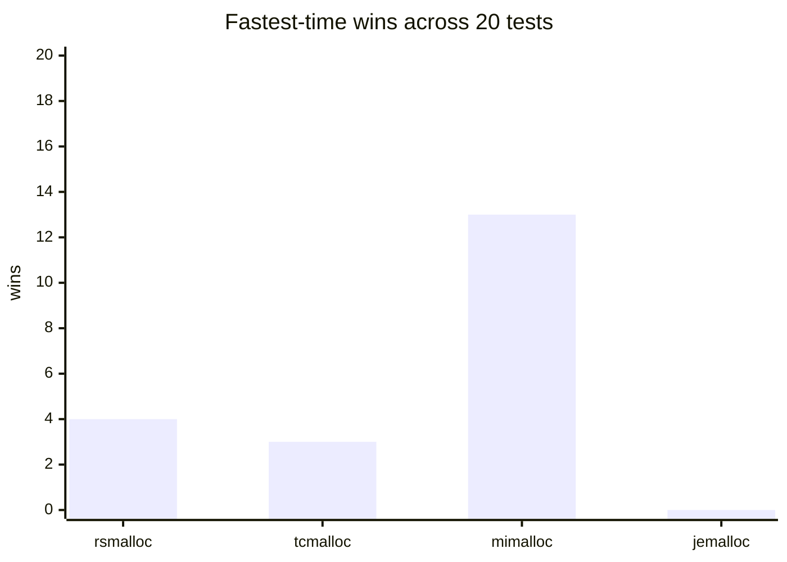
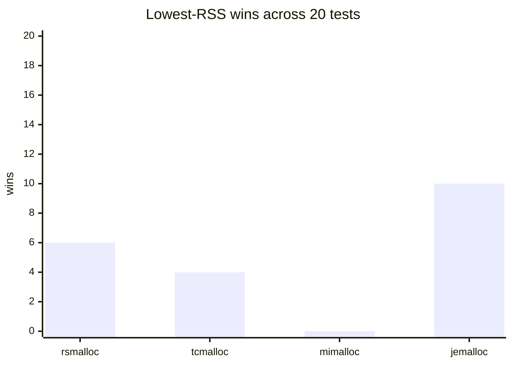
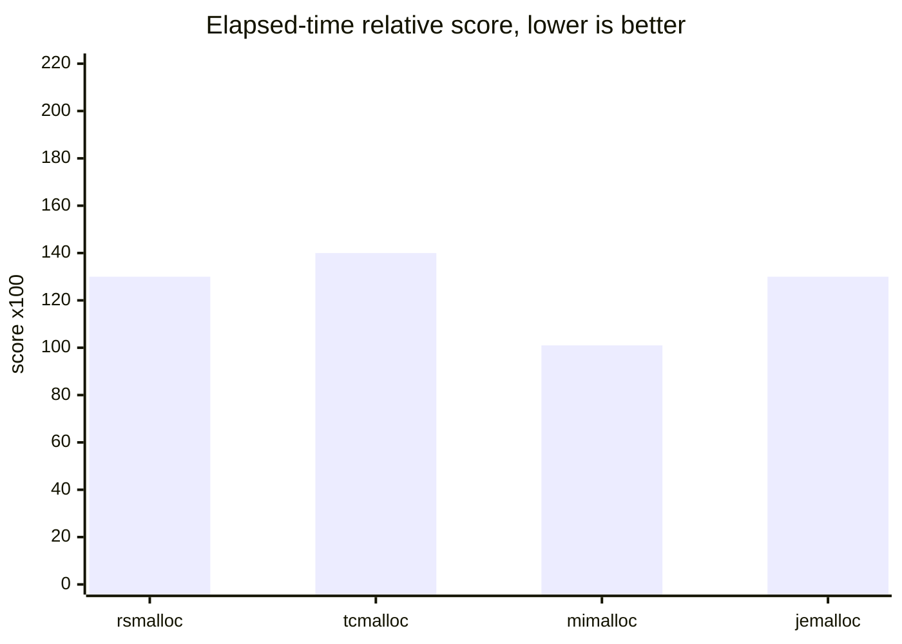
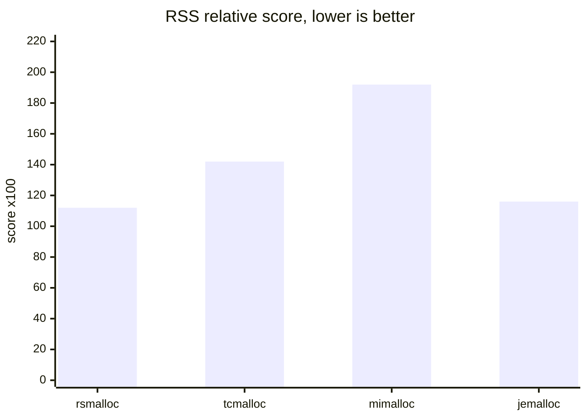
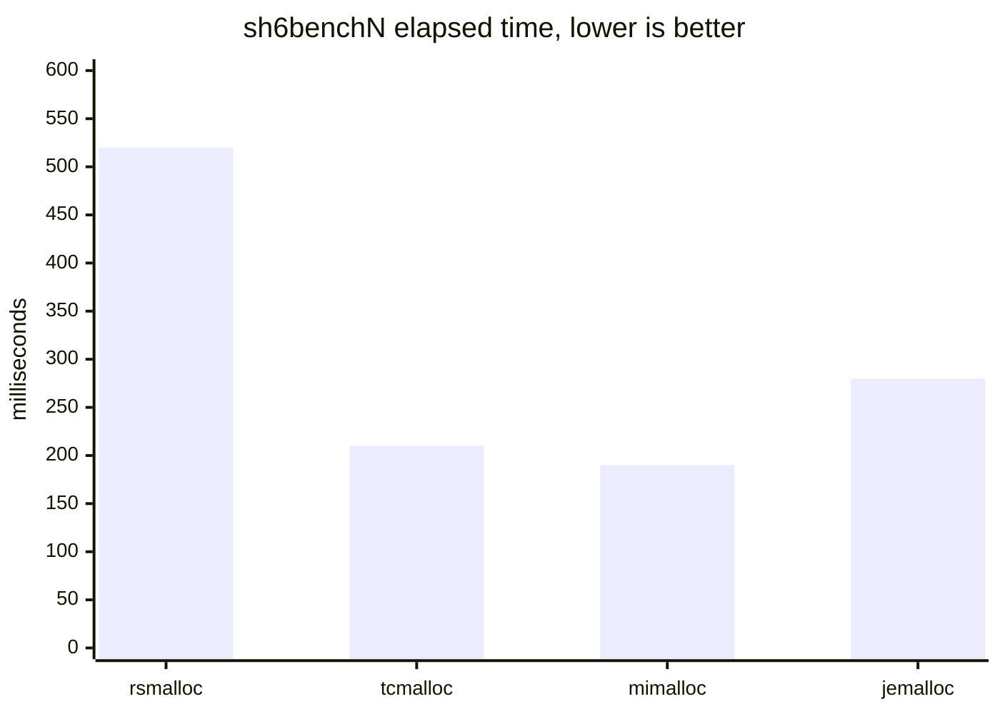
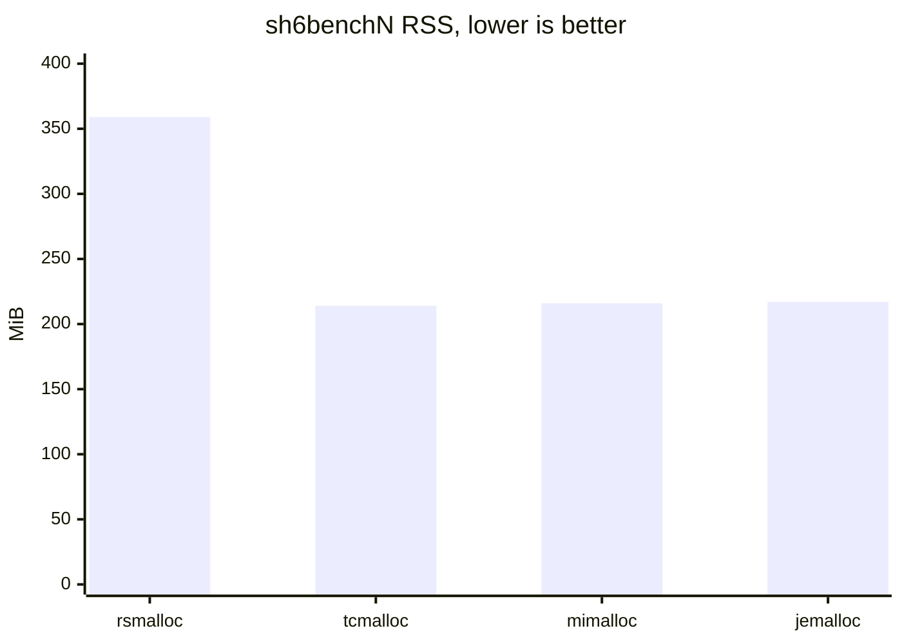
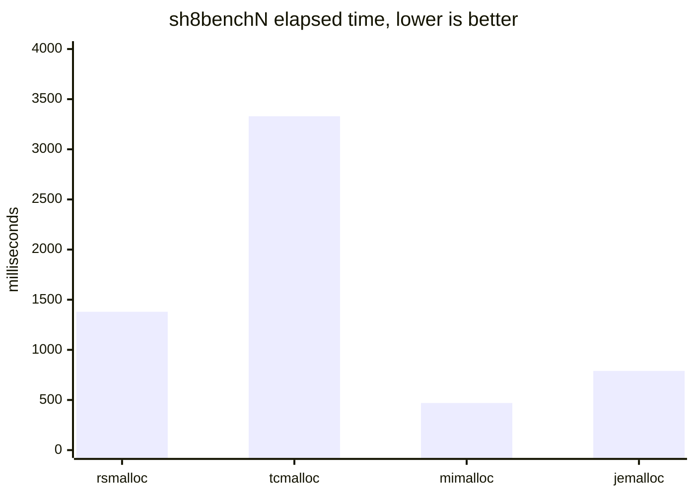
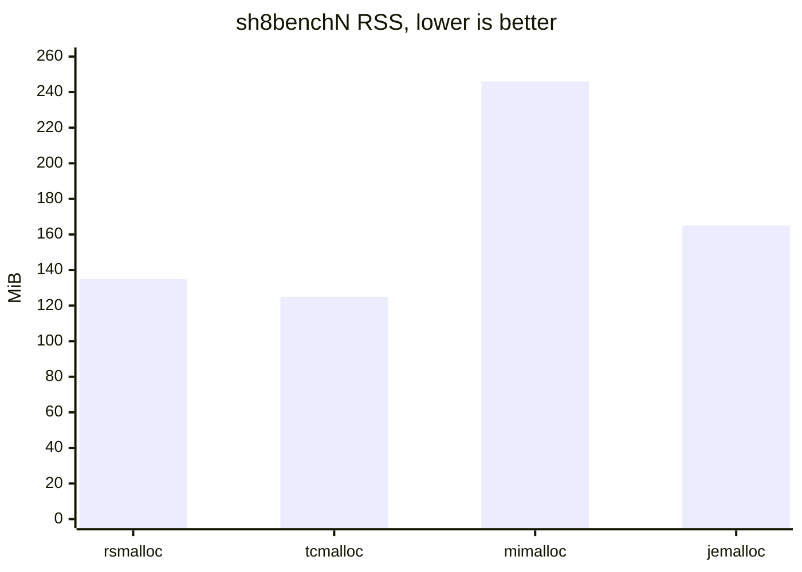

# Benchmarks

This directory contains development benchmark snapshots for rsmalloc and a few
widely used allocators. The raw overall result table is stored in
[`benchmark_overall.txt`](benchmark_overall.txt).

See [`real_workloads.md`](real_workloads.md) for microarchitectural observations.

## Important Warning

These numbers do **not** reflect guaranteed real-world application performance.
They are a development signal for allocator behavior under this specific
benchmark setup. Results can change with CPU topology, kernel version, compiler
flags, preload/global-allocator mode, workload mix, background system activity,
THP settings, NUMA layout, and allocator configuration.

Do not use these results as a stable performance claim. Use them to understand
where rsmalloc currently looks strong or weak, then test with your own workload.

## Current Snapshot

The current snapshot compares:

* `rsmalloc 0.1.0-alpha`
* `tcmalloc 4.6.5`
* `mimalloc 3.3.2`
* `jemalloc 5.3.0`

## Test Environment

This snapshot was collected with `mimalloc-bench` on:

* Fedora 44
* default Fedora kernel
* AMD Ryzen 5 5600X
* DDR4 3200 MT/s CL16 RAM

The table records:

* `time`: elapsed benchmark time
* `rss`: resident set size reported by the benchmark harness
* `user`: user CPU time
* `sys`: system CPU time
* `page-faults`: major page faults
* `page-reclaims`: minor page faults / reclaims as reported by the harness

Lower values are generally better for `time`, `rss`, CPU time, and fault counts,
but allocator tradeoffs are workload-dependent. A result that is good for one
test can be bad for another real application.

## Reading The Results

The table should be read as a rough comparison across allocator behavior, not as
a ranking. Some tests are closer to synthetic allocator stress, while others are
larger application-style workloads. rsmalloc is still alpha software, so both
performance and memory behavior are expected to move as internals change.

The `sh6benchN` and `sh8benchN` tests are especially unfriendly to the current
RSEQ-centered design and should be treated as worst-case RSEQ stress tests, not
as representative application behavior.

In some tests, the RSEQ critical sections abort extremely frequently because the
kernel preempts or migrates the running thread inside the critical section. Those
aborts force retry/fallback work and can account for a large part of rsmalloc's
runtime in the affected benchmarks. These results therefore measure both allocator
policy and workload/scheduler interaction with RSEQ.

## Mermaid Summary

These column charts are parsed from [`benchmark_overall.txt`](benchmark_overall.txt). Lower is better
for elapsed time, RSS, and relative-to-best scores. RSS values are converted from
KiB to MiB for readability. When the raw snapshot contains alternate/noisy runs
for the same allocator/test pair, the first listed run is used for these charts.

### Per-test winner counts

### Overall relative score

A score of `100` means matching the best observed allocator for every test.
Higher values are worse. These are geometric means of each allocator's per-test
ratio to the best result for that test, scaled by `100` for cleaner chart axes.
For example, `138` means `1.38x` the per-test best.

### `sh6benchN` stress case

`sh6benchN` is the worst RSS case for this rsmalloc snapshot.

### `sh8benchN` stress case

`sh8benchN` is a RSEQ worst case for rsmalloc in this snapshot. The values below
come from the current [`benchmark_overall.txt`](benchmark_overall.txt) snapshot.

For real evaluation, run the allocator against the target application with the
same deployment mode and configuration that would be used in production.
