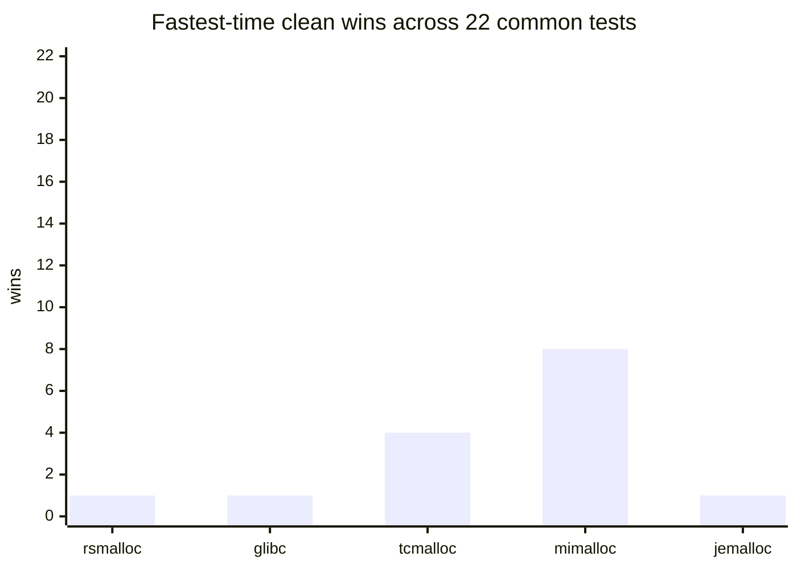
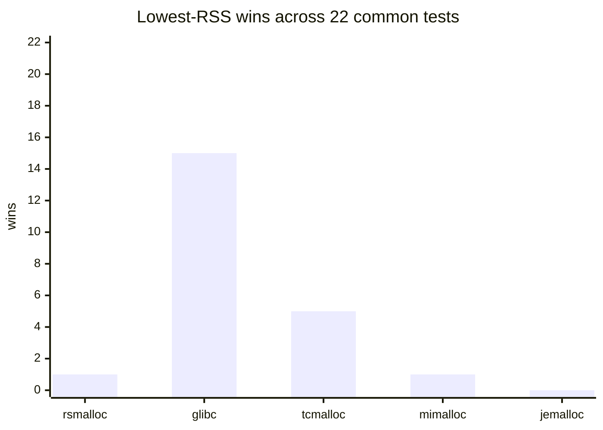
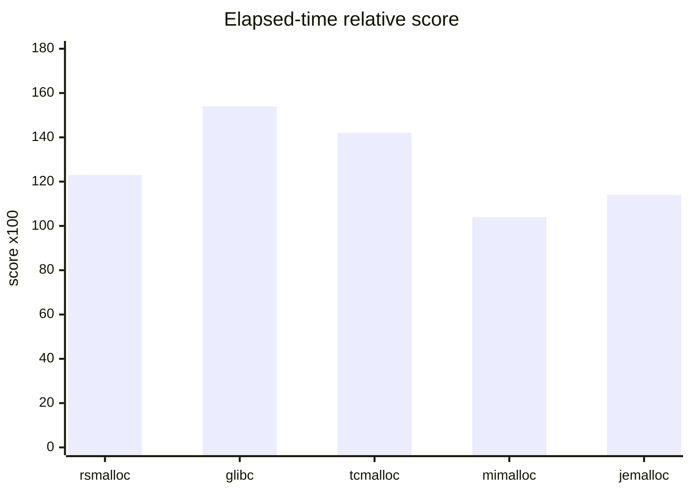
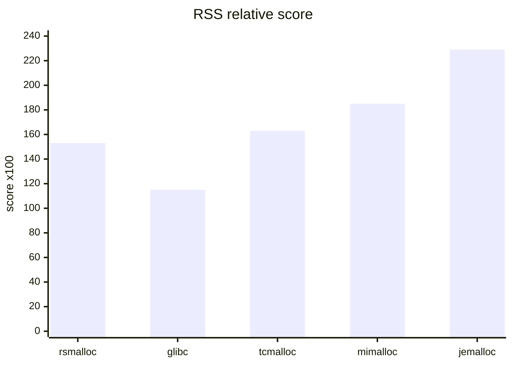
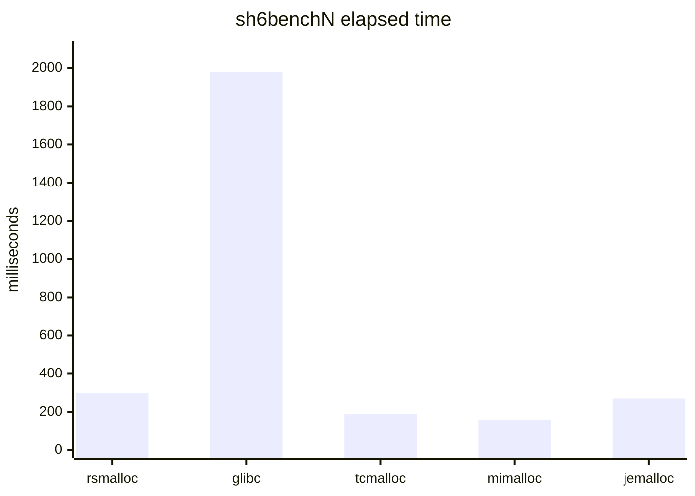
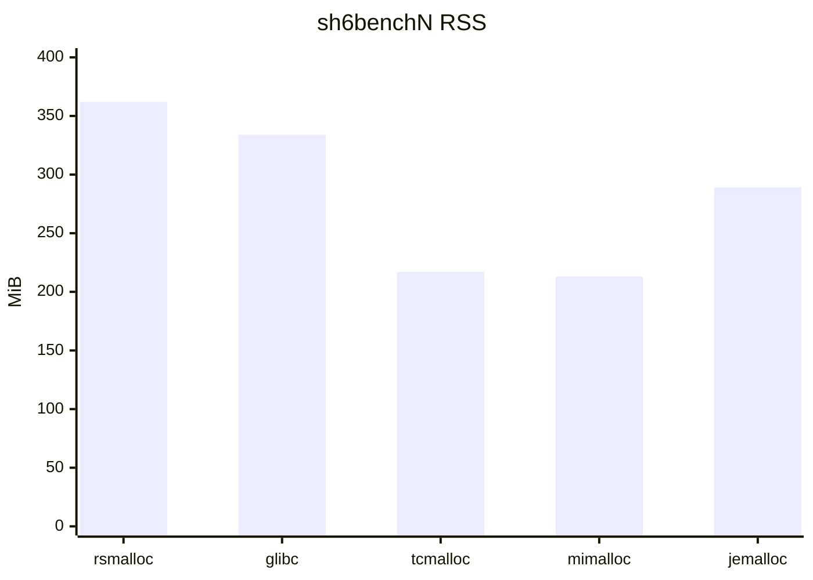
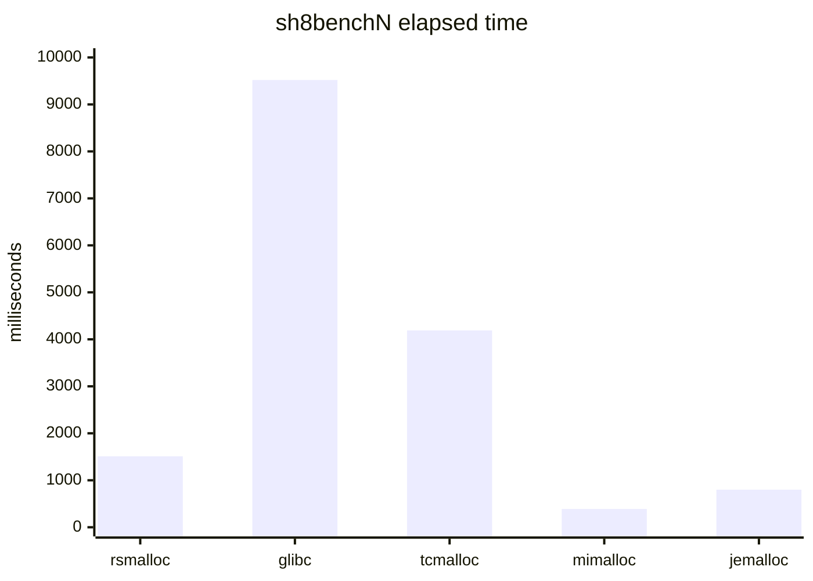
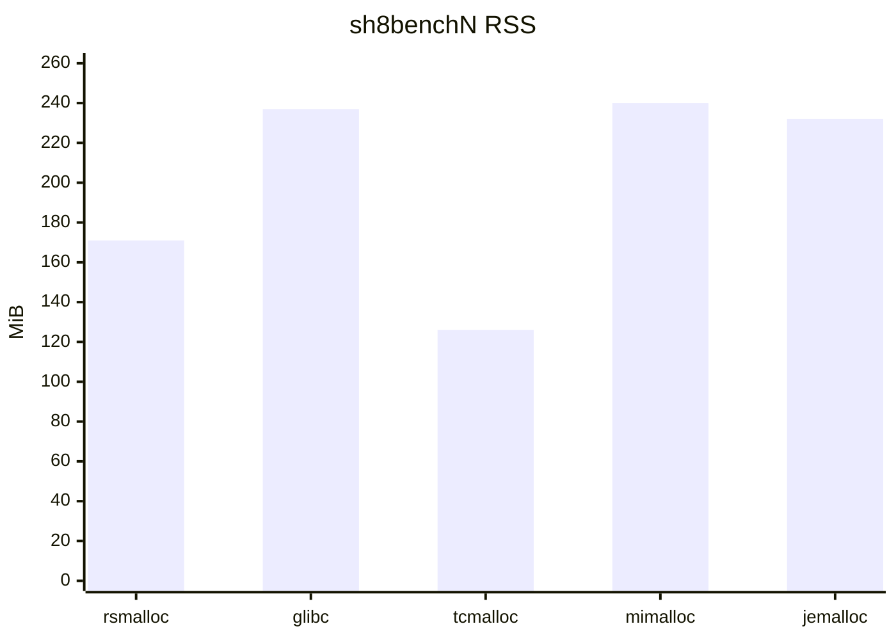

# Benchmarks

This directory contains development benchmark snapshots for RSMalloc and several widely used allocators. The raw measurements are in [`benchmark_overall.txt`](benchmark_overall.txt).

See [`real_workloads.md`](real_workloads.md) for application-oriented observations. A reproducible MariaDB/sysbench memory harness is available under [`mariadb/`](mariadb/README.md).

## Important Warning

These results are development signals, not general performance guarantees. CPU topology, kernel and libc versions, compiler flags, preload mode, THP policy, NUMA layout, background activity, and allocator configuration can materially change the results.

Test the allocator with the target workload and production configuration before drawing conclusions.

## Current Snapshot

The current release-candidate snapshot includes:

- RSMalloc `0.3.0-alpha`
- glibc `2.44`
- tcmalloc, latest CachyOS build at collection time
- mimalloc `3.5`
- jemalloc `5.3.1`

The raw file contains 22 alpha-3 results, and aggregate charts use all **22 tests shared by all five allocators**.

RSMalloc has two `rptestN` measurements. Aggregates use the first result (`0.597 s`), collected while running the complete suite. The independent result (`0.631 s`) remains in the raw file to show observed run-order variance.

Historical alpha-2 rows remain in the raw file for development context but are not included in the charts.

## Test Environment

The snapshot was collected with `mimalloc-bench` on:

- CPU: AMD Ryzen 5 5600X
- RAM: 16 GiB DDR4-3200
- OS: CachyOS, kernel `7.2.6-1-cachyos-bore`
- Desktop: KDE Plasma
- Motherboard: MSI B550M PRO-VDH

The alpha-3 snapshot used kernel `7.2.6-1-cachyos-bore`, which differs from some historical rows. This is another reason not to treat cross-version RSS as directly comparable.

The raw columns are:

- `time`: elapsed time in seconds
- `rss`: resident set size in KiB
- `user`: user CPU time in seconds
- `sys`: system CPU time in seconds
- `page-faults`: major page faults
- `page-reclaims`: minor faults/reclaims reported by the harness

Lower is generally better, but allocator tradeoffs are workload-dependent.

## Reading the Results

The synthetic tests exercise very different allocator behavior. In particular:

- `alloc-testN` performs roughly 600 million allocations and 600 million frees, amplifying every instruction in the local allocation/free paths.
- `sh6benchN` and `sh8benchN` are difficult contention and scheduler-interaction cases for RSMalloc's RSEQ-centered design.
- `xmalloc-testN` strongly favors very small conventional fast paths and remains an expected RSMalloc weakness.

The tables should therefore be read as a workload profile, not as a universal allocator ranking.

## Summary

The following values were calculated from the 22-test common set in [`benchmark_overall.txt`](benchmark_overall.txt). Exact ties at the harness's reported precision are excluded from clean winner counts.

### Per-test winner counts

Seven elapsed-time tests tie:

- `cache-scratch1`: all five allocators
- `cache-scratchN`: RSMalloc and glibc
- `gs`: RSMalloc, mimalloc, and tcmalloc
- `mstressN`: mimalloc and tcmalloc
- `rbstressN`: RSMalloc and tcmalloc
- `redis`: RSMalloc, mimalloc, and tcmalloc
- `z3`: all five allocators

The clean elapsed-time wins therefore total 15 rather than 22.

```mermaid
xychart-beta
    title "Fastest-time clean wins across 22 common tests"
    x-axis [rsmalloc, glibc, tcmalloc, mimalloc, jemalloc]
    y-axis "wins" 0 --> 22
    bar [1, 1, 4, 8, 1]
```

```mermaid
xychart-beta
    title "Lowest-RSS wins across 22 common tests"
    x-axis [rsmalloc, glibc, tcmalloc, mimalloc, jemalloc]
    y-axis "wins" 0 --> 22
    bar [1, 15, 5, 1, 0]
```

### Overall relative score

For each test, an allocator's result is divided by the best result for that test. The chart reports the geometric mean of those ratios multiplied by 100. A score of `100` would match the best allocator on every test; lower is better.

```mermaid
xychart-beta
    title "Elapsed-time relative score"
    x-axis [rsmalloc, glibc, tcmalloc, mimalloc, jemalloc]
    y-axis "score x100" 0 --> 180
    bar [123, 154, 142, 104, 114]
```

```mermaid
xychart-beta
    title "RSS relative score"
    x-axis [rsmalloc, glibc, tcmalloc, mimalloc, jemalloc]
    y-axis "score x100" 0 --> 240
    bar [153, 115, 163, 185, 229]
```

### Stress cases

```mermaid
xychart-beta
    title "sh6benchN elapsed time"
    x-axis [rsmalloc, glibc, tcmalloc, mimalloc, jemalloc]
    y-axis "milliseconds" 0 --> 2100
    bar [300, 1980, 190, 160, 270]
```

```mermaid
xychart-beta
    title "sh6benchN RSS"
    x-axis [rsmalloc, glibc, tcmalloc, mimalloc, jemalloc]
    y-axis "MiB" 0 --> 400
    bar [362, 334, 217, 213, 289]
```

```mermaid
xychart-beta
    title "sh8benchN elapsed time"
    x-axis [rsmalloc, glibc, tcmalloc, mimalloc, jemalloc]
    y-axis "milliseconds" 0 --> 10000
    bar [1510, 9520, 4190, 390, 800]
```

```mermaid
xychart-beta
    title "sh8benchN RSS"
    x-axis [rsmalloc, glibc, tcmalloc, mimalloc, jemalloc]
    y-axis "MiB" 0 --> 260
    bar [171, 237, 126, 240, 232]
```

### Page-reclaim and system-time totals

These totals cover the same 22-test common set and are not included in the relative scores.

| Allocator | Minor page-reclaims | System CPU time |
| --- | ---: | ---: |
| RSMalloc | 118,625 | 4.78 s |
| glibc | 909,741 | 54.20 s |
| tcmalloc | 459,050 | 42.30 s |
| mimalloc | 115,224 | 3.77 s |
| jemalloc | 1,296,726 | 6.70 s |

Instrumentation, scheduler variation, and outlier stress tests can strongly affect these totals. Use the raw per-test rows when investigating a specific result.
