# Detailed Benchmark Results

[Overview and aggregate charts](benchmarks.md) · [Source measurements](benchmark_overall.txt)

A readable comparison of **22 workloads across five allocators**, with every reported metric and separate elapsed-time and memory charts. Historical alpha-2 rows are excluded.

## Measurement notes

- These are development snapshots, **not production performance guarantees**. Test with your own workload and configuration.
- All five allocators use **column-wise medians of ten runs for the same 20 workloads**. `rbstressN` and `z3` retain older single-run results for every allocator and are explicitly marked below.
- RSMalloc uses the previously supplied ten-run dataset; the other four allocators use the newly supplied ten-run datasets. Version labels and environment details are retained from the existing snapshot; new build/configuration metadata was not supplied. Repeated-run medians do not by themselves establish statistical significance for small differences.
- For ten runs, a median averages the fifth and sixth sorted values. Extra decimal places and fractional fault counts come from aggregation, not extra harness precision. Different column medians need not describe one actual run.
- Elapsed time is wall-clock seconds; user/system values are CPU seconds and can exceed elapsed time in multithreaded workloads. RSS is reported in KiB in the tables and converted to MiB in the charts.
- Major faults and minor faults/reclaims are separate harness counters. Lower values are generally preferable, but neither memory use nor fault counts alone explain throughput.
- **Bold elapsed-time and RSS cells mark the best reported value**, including exact ties. Best values are determined before rounding chart values. All charts start at zero and use independent scales; compare bars within a chart, not across workloads.

Environment recorded for this snapshot: AMD Ryzen 5 5600X, 16 GiB DDR4-3200, CachyOS kernel `7.2.6-1-cachyos-bore`, KDE Plasma, MSI B550M PRO-VDH. See the [overview](benchmarks.md#test-environment) for context. Compiler/configuration details and per-run distributions are not fully recorded in the source file.

## At a glance

The relative scores below are the geometric mean of each result divided by the best result for that workload, multiplied by 100. **100 is ideal; lower is better.** Clean wins exclude ties.

| Allocator | Time score | RSS score | Clean time wins | Clean RSS wins |
| --- | ---: | ---: | ---: | ---: |
| RSMalloc alpha-3 | 121.56 | 155.92 | 4 | 2 |
| glibc 2.44 | 156.12 | 116.96 | 2 | 15 |
| tcmalloc | 140.67 | 162.14 | 3 | 4 |
| mimalloc 3.5 | 103.56 | 188.67 | 8 | 1 |
| jemalloc 5.3.1 | 114.20 | 232.96 | 0 | 0 |

### Workload index

| Workload | RSMalloc elapsed (s) | RSMalloc RSS (KiB) | Fastest reported | Lowest reported RSS |
| --- | ---: | ---: | --- | --- |
| [cfrac](#cfrac) | 3.01 | 7,372 | mimalloc | glibc |
| [espresso](#espresso) | 2.96 | 7,414 | tcmalloc | glibc |
| [barnes](#barnes) | 1.675 | 68,198 | rsmalloc | glibc |
| [redis](#redis) | 2.79 | 13,560 | glibc | glibc |
| [leanN](#leann) | 7.21 | 269,886 | mimalloc | tcmalloc |
| [larsonN-sized](#larsonn-sized) | 3.299 | 80,388 | tcmalloc | rsmalloc |
| [mstressN](#mstressn) | 1.03 | 332,896 | tcmalloc, mimalloc | tcmalloc |
| [rptestN](#rptestn) | 0.638 | 63,340 | glibc | glibc |
| [gs](#gs) | 0.18 | 47,180 | rsmalloc | glibc |
| [lua](#lua) | 0.99 | 113,680 | rsmalloc | glibc |
| [alloc-test1](#alloc-test1) | 2.3 | 19,166 | mimalloc | glibc |
| [alloc-testN](#alloc-testn) | 3.1 | 25,434 | mimalloc | glibc |
| [sh6benchN](#sh6benchn) | 0.31 | 369,682 | mimalloc | mimalloc |
| [sh8benchN](#sh8benchn) | 1.595 | 176,282 | mimalloc | tcmalloc |
| [xmalloc-testN](#xmalloc-testn) | 0.715 | 18,244 | mimalloc | rsmalloc |
| [cache-scratch1](#cache-scratch1) | 0.86 | 8,822 | rsmalloc, glibc, tcmalloc, mimalloc, jemalloc | glibc |
| [cache-scratchN](#cache-scratchn) | 0.16 | 8,816 | glibc, tcmalloc, jemalloc | glibc |
| [glibc-simple](#glibc-simple) | 1.55 | 7,384 | tcmalloc | glibc |
| [glibc-thread](#glibc-thread) | 1.2245 | 10,996 | mimalloc | glibc |
| [rocksdb](#rocksdb) | 3.205 | 109,856 | rsmalloc | glibc |
| [rbstressN](#rbstressn) (older run) | 3.06 | 151,956 | rsmalloc, tcmalloc | tcmalloc |
| [z3](#z3) (older run) | 0.05 | 54,444 | rsmalloc, glibc, tcmalloc, mimalloc, jemalloc | glibc |

## cfrac

| Allocator | Elapsed (s) | RSS (KiB) | User CPU (s) | System CPU (s) | Major faults | Minor faults/reclaims |
| --- | ---: | ---: | ---: | ---: | ---: | ---: |
| RSMalloc alpha-3 | 3.01 | 7,372 | 3 | 0 | 0 | 256.5 |
| glibc 2.44 | 2.87 | **3,278** | 2.86 | 0 | 0 | 438 |
| tcmalloc | 2.88 | 11,108 | 2.87 | 0 | 0 | 1,752 |
| mimalloc 3.5 | **2.835** | 4,916 | 2.82 | 0 | 0 | 220 |
| jemalloc 5.3.1 | 2.94 | 11,564 | 2.93 | 0 | 0 | 401 |

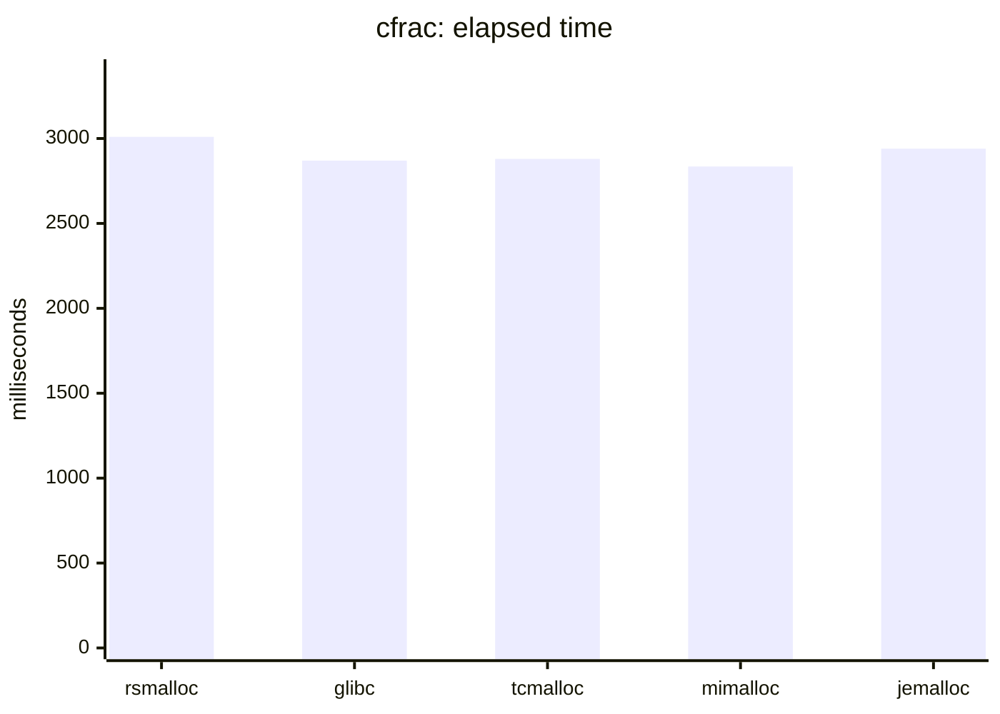
```mermaid
xychart-beta
    title "cfrac: elapsed time"
    x-axis [rsmalloc, glibc, tcmalloc, mimalloc, jemalloc]
    y-axis "milliseconds" 0 --> 3400
    bar [3010, 2870, 2880, 2835, 2940]
```

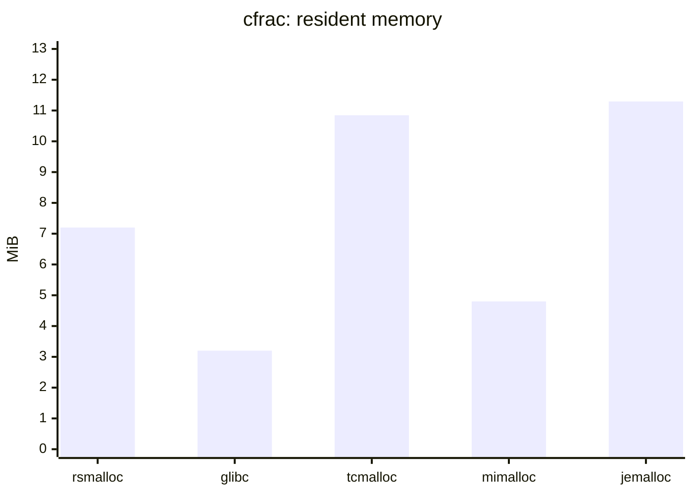
```mermaid
xychart-beta
    title "cfrac: resident memory"
    x-axis [rsmalloc, glibc, tcmalloc, mimalloc, jemalloc]
    y-axis "MiB" 0 --> 13
    bar [7.199, 3.201, 10.848, 4.801, 11.293]
```

[Back to workload index](#workload-index)

## espresso

| Allocator | Elapsed (s) | RSS (KiB) | User CPU (s) | System CPU (s) | Major faults | Minor faults/reclaims |
| --- | ---: | ---: | ---: | ---: | ---: | ---: |
| RSMalloc alpha-3 | 2.96 | 7,414 | 2.935 | 0.01 | 0 | 254.5 |
| glibc 2.44 | 3.21 | **3,336** | 3.18 | 0.02 | 0 | 582 |
| tcmalloc | **2.88** | 11,814 | 2.855 | 0.02 | 0 | 1,735 |
| mimalloc 3.5 | 2.91 | 10,960 | 2.89 | 0.01 | 0 | 225 |
| jemalloc 5.3.1 | 2.99 | 11,540 | 2.96 | 0.015 | 0 | 404 |

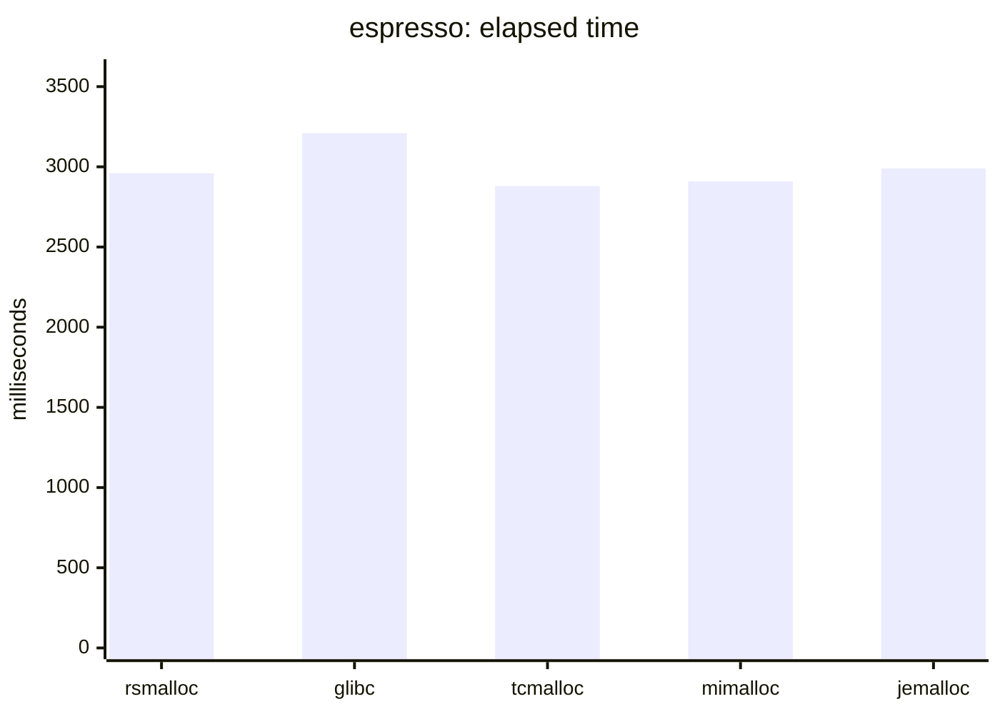
```mermaid
xychart-beta
    title "espresso: elapsed time"
    x-axis [rsmalloc, glibc, tcmalloc, mimalloc, jemalloc]
    y-axis "milliseconds" 0 --> 3600
    bar [2960, 3210, 2880, 2910, 2990]
```

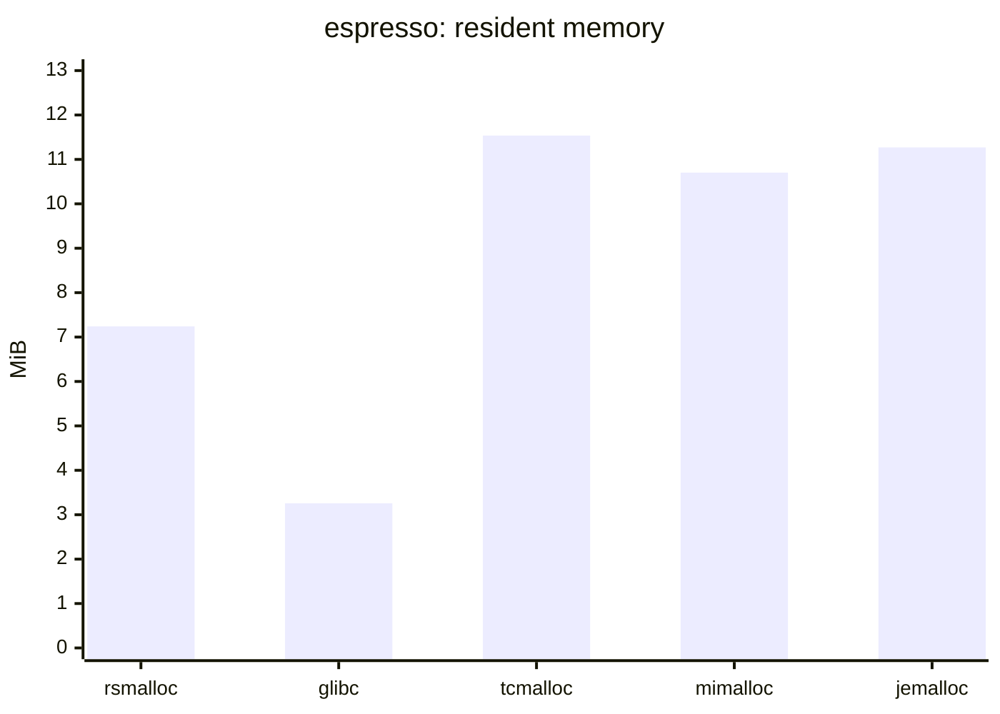
```mermaid
xychart-beta
    title "espresso: resident memory"
    x-axis [rsmalloc, glibc, tcmalloc, mimalloc, jemalloc]
    y-axis "MiB" 0 --> 13
    bar [7.24, 3.258, 11.537, 10.703, 11.27]
```

[Back to workload index](#workload-index)

## barnes

| Allocator | Elapsed (s) | RSS (KiB) | User CPU (s) | System CPU (s) | Major faults | Minor faults/reclaims |
| --- | ---: | ---: | ---: | ---: | ---: | ---: |
| RSMalloc alpha-3 | **1.675** | 68,198 | 1.665 | 0 | 0 | 684 |
| glibc 2.44 | 1.695 | **62,178** | 1.685 | 0 | 0 | 776 |
| tcmalloc | 1.7 | 76,146 | 1.69 | 0 | 0 | 2,088 |
| mimalloc 3.5 | 1.7 | 67,588 | 1.69 | 0 | 0 | 571 |
| jemalloc 5.3.1 | 1.68 | 77,208 | 1.67 | 0 | 0 | 539.5 |

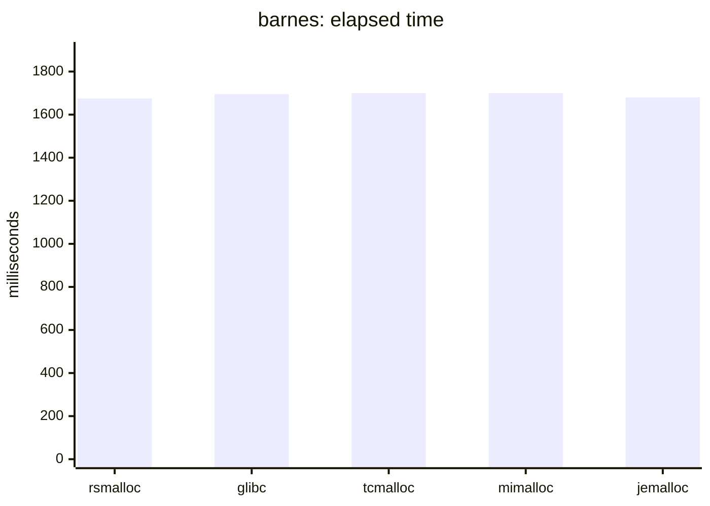
```mermaid
xychart-beta
    title "barnes: elapsed time"
    x-axis [rsmalloc, glibc, tcmalloc, mimalloc, jemalloc]
    y-axis "milliseconds" 0 --> 1900
    bar [1675, 1695, 1700, 1700, 1680]
```

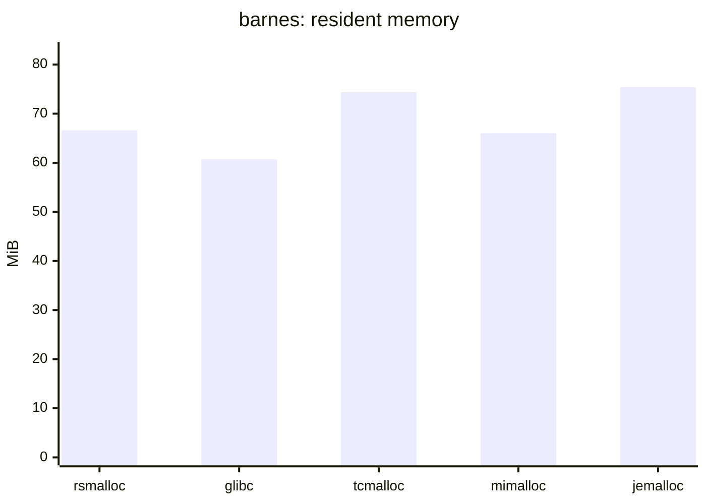
```mermaid
xychart-beta
    title "barnes: resident memory"
    x-axis [rsmalloc, glibc, tcmalloc, mimalloc, jemalloc]
    y-axis "MiB" 0 --> 83
    bar [66.6, 60.721, 74.361, 66.004, 75.398]
```

[Back to workload index](#workload-index)

## redis

| Allocator | Elapsed (s) | RSS (KiB) | User CPU (s) | System CPU (s) | Major faults | Minor faults/reclaims |
| --- | ---: | ---: | ---: | ---: | ---: | ---: |
| RSMalloc alpha-3 | 2.79 | 13,560 | 0.095 | 0.03 | 0 | 1,465 |
| glibc 2.44 | **2.64** | **8,144** | 0.09 | 0.03 | 0 | 1,209.5 |
| tcmalloc | 2.66 | 15,526 | 0.09 | 0.03 | 0 | 2,691 |
| mimalloc 3.5 | 2.8095 | 15,514 | 0.1 | 0.03 | 0 | 979.5 |
| jemalloc 5.3.1 | 3.22 | 15,958 | 0.12 | 0.03 | 0 | 1,177.5 |

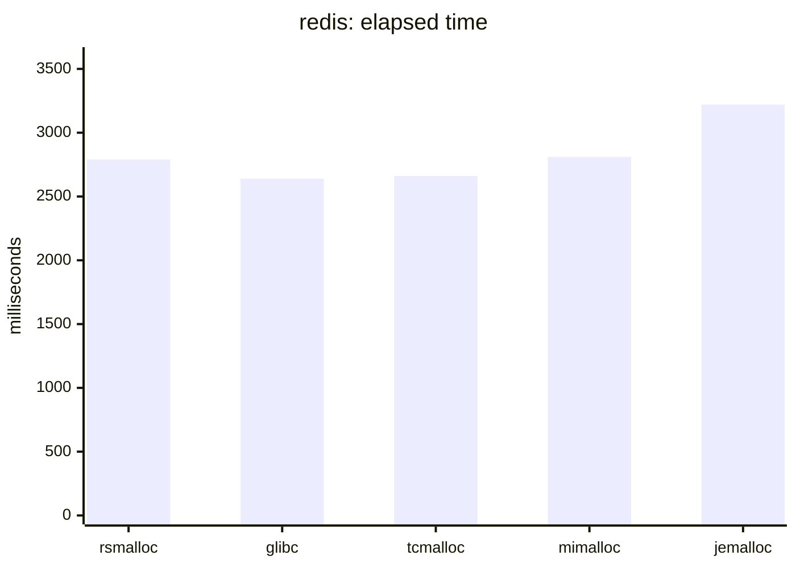
```mermaid
xychart-beta
    title "redis: elapsed time"
    x-axis [rsmalloc, glibc, tcmalloc, mimalloc, jemalloc]
    y-axis "milliseconds" 0 --> 3600
    bar [2790, 2640, 2660, 2809.5, 3220]
```

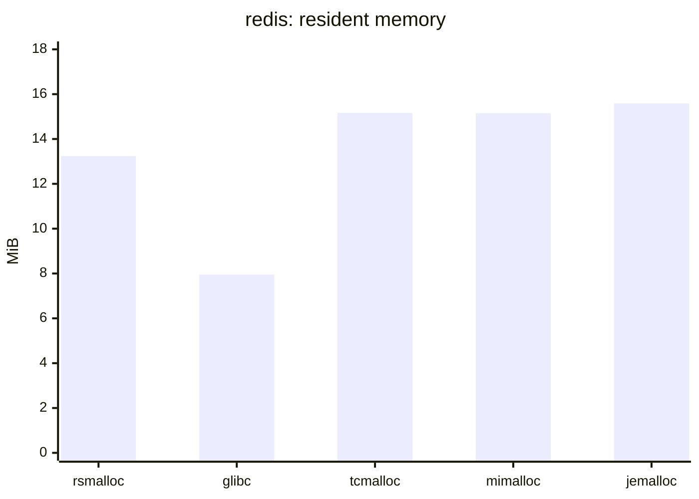
```mermaid
xychart-beta
    title "redis: resident memory"
    x-axis [rsmalloc, glibc, tcmalloc, mimalloc, jemalloc]
    y-axis "MiB" 0 --> 18
    bar [13.242, 7.953, 15.162, 15.15, 15.584]
```

[Back to workload index](#workload-index)

## leanN

| Allocator | Elapsed (s) | RSS (KiB) | User CPU (s) | System CPU (s) | Major faults | Minor faults/reclaims |
| --- | ---: | ---: | ---: | ---: | ---: | ---: |
| RSMalloc alpha-3 | 7.21 | 269,886 | 16.54 | 0.16 | 0 | 1,051.5 |
| glibc 2.44 | 8.225 | 255,400 | 18.375 | 0.44 | 0 | 62,601.5 |
| tcmalloc | 7.435 | **210,132** | 16.895 | 0.27 | 0 | 48,740.5 |
| mimalloc 3.5 | **6.94** | 344,670 | 16.11 | 0.21 | 0 | 1,830.5 |
| jemalloc 5.3.1 | 6.96 | 267,652 | 15.66 | 0.23 | 0 | 15,693 |

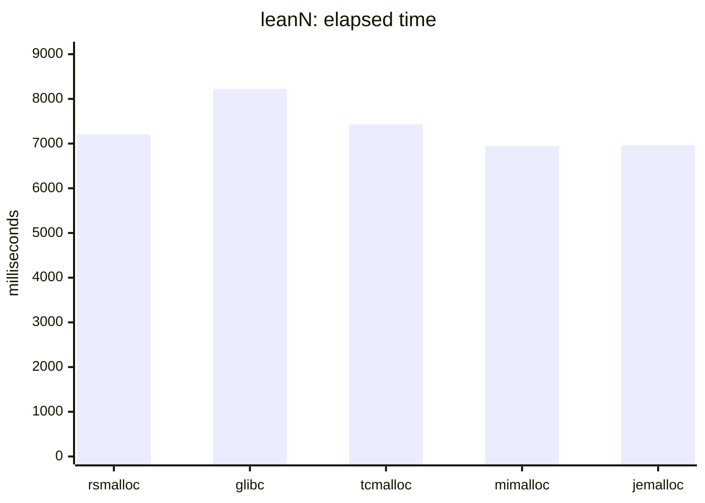
```mermaid
xychart-beta
    title "leanN: elapsed time"
    x-axis [rsmalloc, glibc, tcmalloc, mimalloc, jemalloc]
    y-axis "milliseconds" 0 --> 9100
    bar [7210, 8225, 7435, 6940, 6960]
```

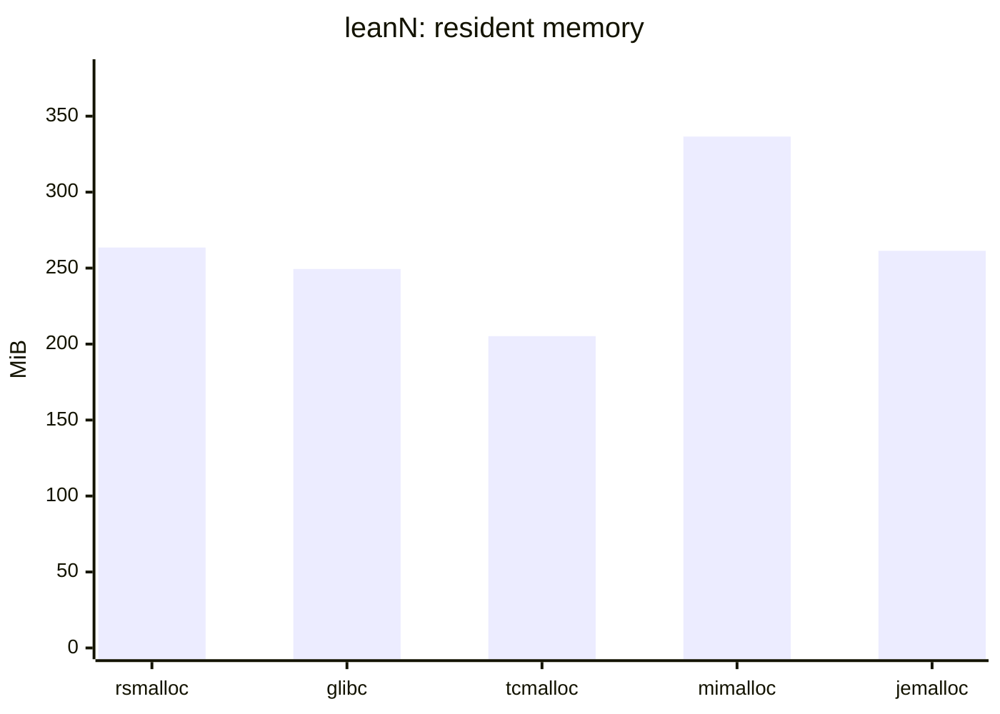
```mermaid
xychart-beta
    title "leanN: resident memory"
    x-axis [rsmalloc, glibc, tcmalloc, mimalloc, jemalloc]
    y-axis "MiB" 0 --> 380
    bar [263.561, 249.414, 205.207, 336.592, 261.379]
```

[Back to workload index](#workload-index)

## larsonN-sized

| Allocator | Elapsed (s) | RSS (KiB) | User CPU (s) | System CPU (s) | Major faults | Minor faults/reclaims |
| --- | ---: | ---: | ---: | ---: | ---: | ---: |
| RSMalloc alpha-3 | 3.299 | **80,388** | 58.645 | 0.115 | 0 | 6,571 |
| glibc 2.44 | 4.079 | 122,658 | 56.895 | 2 | 0 | 33,453.5 |
| tcmalloc | **2.9265** | 84,840 | 59.385 | 0.17 | 0 | 19,167.5 |
| mimalloc 3.5 | 3.0025 | 133,012 | 59.08 | 0.31 | 0 | 8,933 |
| jemalloc 5.3.1 | 3.0465 | 165,366 | 59.135 | 0.35 | 0 | 55,361 |

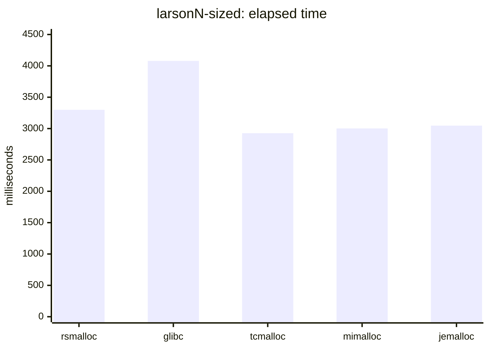
```mermaid
xychart-beta
    title "larsonN-sized: elapsed time"
    x-axis [rsmalloc, glibc, tcmalloc, mimalloc, jemalloc]
    y-axis "milliseconds" 0 --> 4500
    bar [3299, 4079, 2926.5, 3002.5, 3046.5]
```

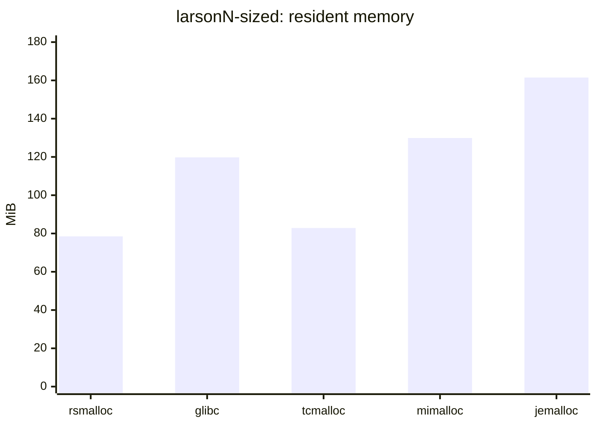
```mermaid
xychart-beta
    title "larsonN-sized: resident memory"
    x-axis [rsmalloc, glibc, tcmalloc, mimalloc, jemalloc]
    y-axis "MiB" 0 --> 180
    bar [78.504, 119.783, 82.852, 129.895, 161.49]
```

[Back to workload index](#workload-index)

## mstressN

| Allocator | Elapsed (s) | RSS (KiB) | User CPU (s) | System CPU (s) | Major faults | Minor faults/reclaims |
| --- | ---: | ---: | ---: | ---: | ---: | ---: |
| RSMalloc alpha-3 | 1.03 | 332,896 | 7.555 | 0.67 | 0 | 1,431.5 |
| glibc 2.44 | 1.075 | 345,078 | 7.245 | 0.905 | 0 | 133,229 |
| tcmalloc | **0.96** | **196,354** | 7.145 | 0.23 | 0 | 37,840.5 |
| mimalloc 3.5 | **0.96** | 387,548 | 7.315 | 0.32 | 0 | 951.5 |
| jemalloc 5.3.1 | 1.23 | 247,326 | 4.67 | 4.09 | 0 | 1,012,505 |

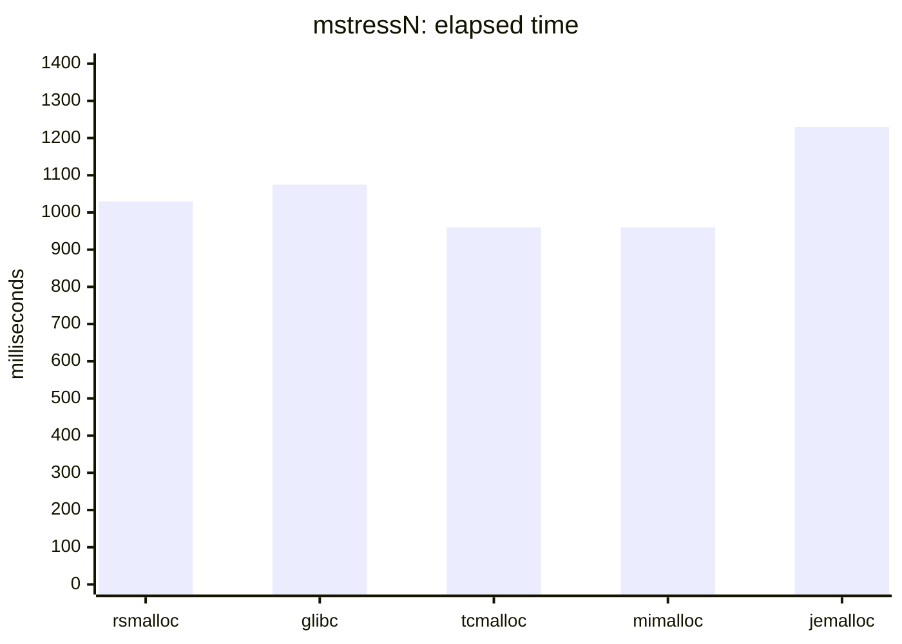
```mermaid
xychart-beta
    title "mstressN: elapsed time"
    x-axis [rsmalloc, glibc, tcmalloc, mimalloc, jemalloc]
    y-axis "milliseconds" 0 --> 1400
    bar [1030, 1075, 960, 960, 1230]
```

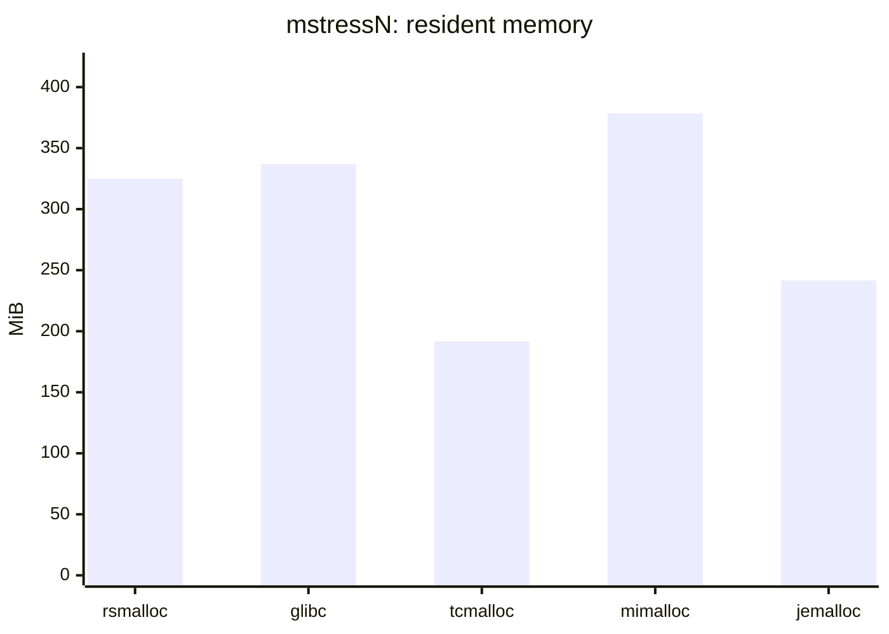
```mermaid
xychart-beta
    title "mstressN: resident memory"
    x-axis [rsmalloc, glibc, tcmalloc, mimalloc, jemalloc]
    y-axis "MiB" 0 --> 420
    bar [325.094, 336.99, 191.752, 378.465, 241.529]
```

[Back to workload index](#workload-index)

## rptestN

| Allocator | Elapsed (s) | RSS (KiB) | User CPU (s) | System CPU (s) | Major faults | Minor faults/reclaims |
| --- | ---: | ---: | ---: | ---: | ---: | ---: |
| RSMalloc alpha-3 | 0.638 | 63,340 | 1.265 | 0.31 | 0 | 609 |
| glibc 2.44 | **0.498** | **40,238** | 0.95 | 0.295 | 0 | 19,828.5 |
| tcmalloc | 0.8985 | 61,110 | 2.115 | 0.09 | 0 | 14,349.5 |
| mimalloc 3.5 | 0.6525 | 107,402 | 1.065 | 0.41 | 0 | 829.5 |
| jemalloc 5.3.1 | 0.8285 | 107,658 | 1.925 | 0.135 | 0 | 15,483.5 |

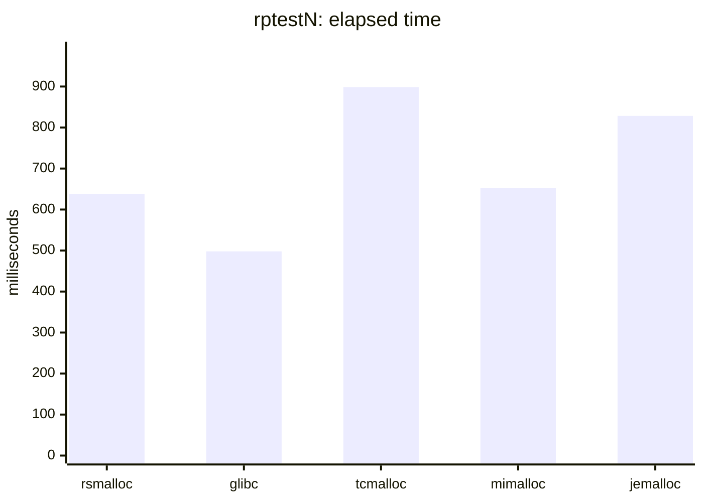
```mermaid
xychart-beta
    title "rptestN: elapsed time"
    x-axis [rsmalloc, glibc, tcmalloc, mimalloc, jemalloc]
    y-axis "milliseconds" 0 --> 990
    bar [638, 498, 898.5, 652.5, 828.5]
```

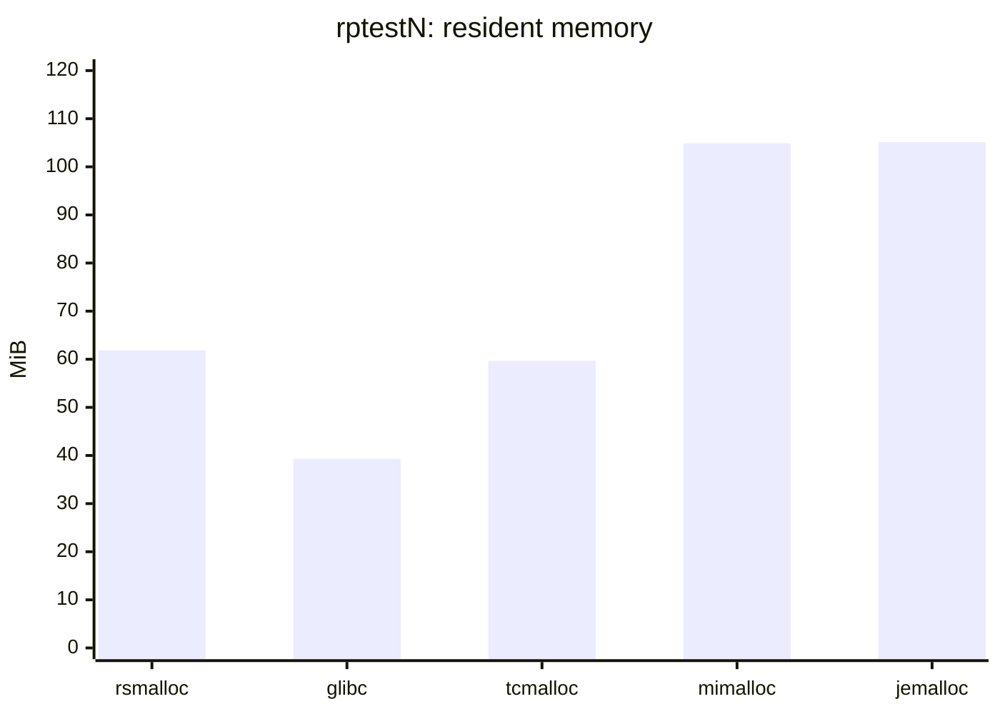
```mermaid
xychart-beta
    title "rptestN: resident memory"
    x-axis [rsmalloc, glibc, tcmalloc, mimalloc, jemalloc]
    y-axis "MiB" 0 --> 120
    bar [61.855, 39.295, 59.678, 104.885, 105.135]
```

[Back to workload index](#workload-index)

## gs

| Allocator | Elapsed (s) | RSS (KiB) | User CPU (s) | System CPU (s) | Major faults | Minor faults/reclaims |
| --- | ---: | ---: | ---: | ---: | ---: | ---: |
| RSMalloc alpha-3 | **0.18** | 47,180 | 0.17 | 0.005 | 0 | 1,482 |
| glibc 2.44 | 0.19 | **32,888** | 0.18 | 0.01 | 0 | 5,401 |
| tcmalloc | 0.2 | 42,716 | 0.18 | 0.01 | 0 | 6,572.5 |
| mimalloc 3.5 | 0.19 | 53,250 | 0.18 | 0.01 | 0 | 1,454 |
| jemalloc 5.3.1 | 0.2 | 44,878 | 0.19 | 0.01 | 0 | 3,078.5 |

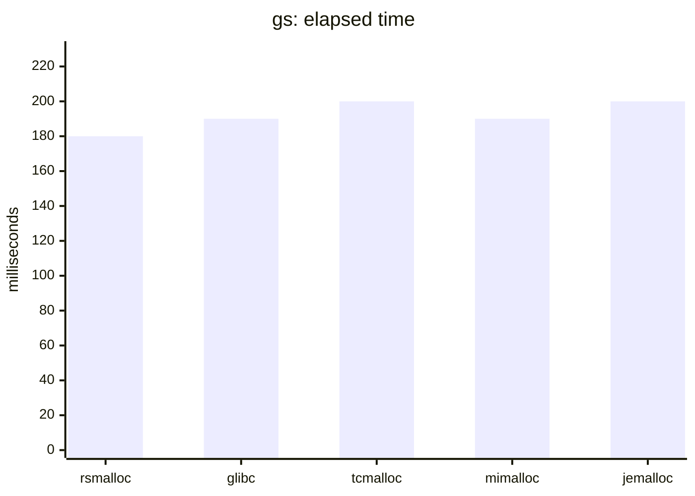
```mermaid
xychart-beta
    title "gs: elapsed time"
    x-axis [rsmalloc, glibc, tcmalloc, mimalloc, jemalloc]
    y-axis "milliseconds" 0 --> 230
    bar [180, 190, 200, 190, 200]
```

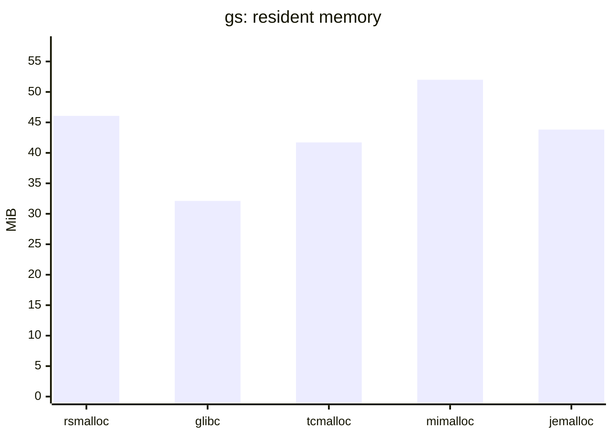
```mermaid
xychart-beta
    title "gs: resident memory"
    x-axis [rsmalloc, glibc, tcmalloc, mimalloc, jemalloc]
    y-axis "MiB" 0 --> 58
    bar [46.074, 32.117, 41.715, 52.002, 43.826]
```

[Back to workload index](#workload-index)

## lua

| Allocator | Elapsed (s) | RSS (KiB) | User CPU (s) | System CPU (s) | Major faults | Minor faults/reclaims |
| --- | ---: | ---: | ---: | ---: | ---: | ---: |
| RSMalloc alpha-3 | **0.99** | 113,680 | 5.785 | 0.35 | 0 | 56,560.5 |
| glibc 2.44 | 1.01 | **88,848** | 5.71 | 0.445 | 0 | 105,241 |
| tcmalloc | 1.06 | 108,492 | 5.88 | 0.76 | 2 | 177,311.5 |
| mimalloc 3.5 | 1.02 | 123,706 | 6.005 | 0.46 | 0 | 55,460.5 |
| jemalloc 5.3.1 | 1.03 | 107,628 | 5.985 | 0.495 | 0 | 75,369 |

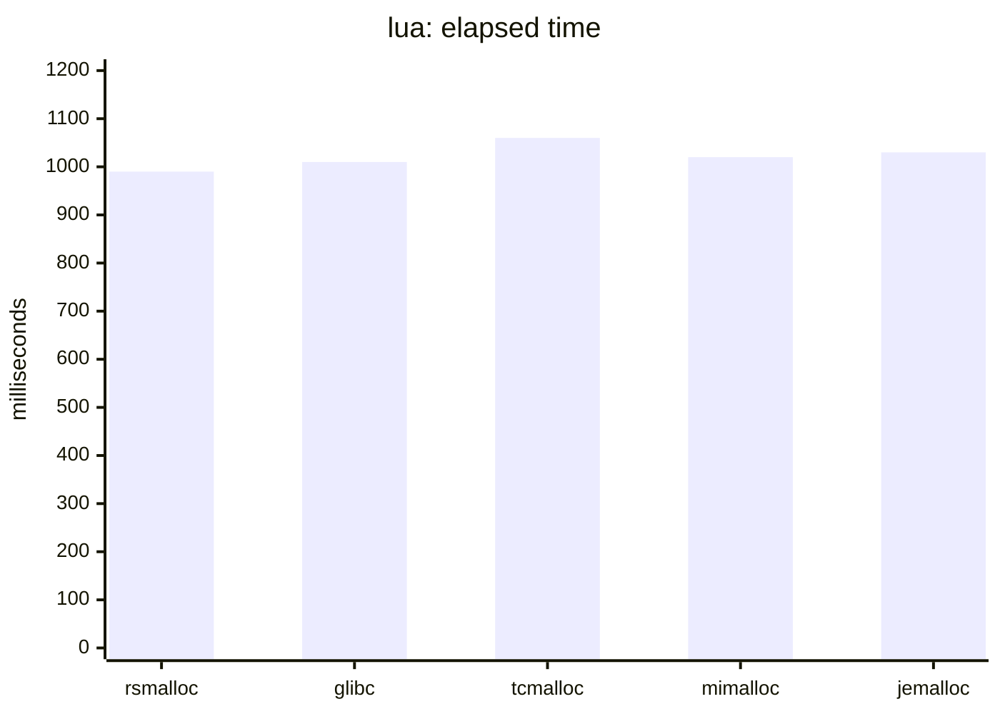
```mermaid
xychart-beta
    title "lua: elapsed time"
    x-axis [rsmalloc, glibc, tcmalloc, mimalloc, jemalloc]
    y-axis "milliseconds" 0 --> 1200
    bar [990, 1010, 1060, 1020, 1030]
```

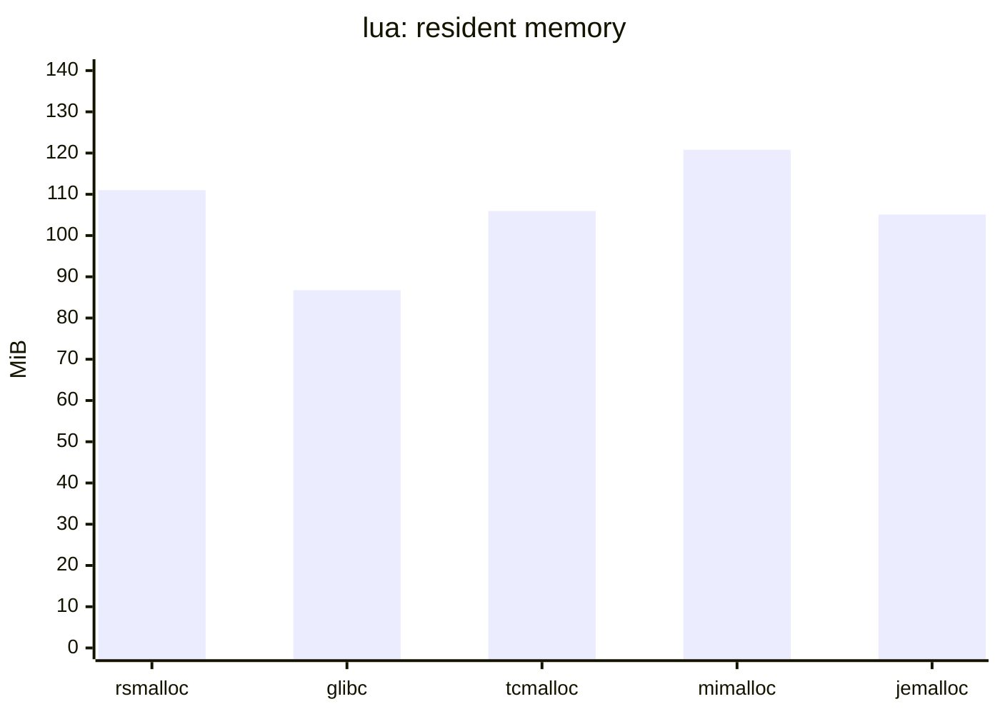
```mermaid
xychart-beta
    title "lua: resident memory"
    x-axis [rsmalloc, glibc, tcmalloc, mimalloc, jemalloc]
    y-axis "MiB" 0 --> 140
    bar [111.016, 86.766, 105.949, 120.807, 105.105]
```

[Back to workload index](#workload-index)

## alloc-test1

| Allocator | Elapsed (s) | RSS (KiB) | User CPU (s) | System CPU (s) | Major faults | Minor faults/reclaims |
| --- | ---: | ---: | ---: | ---: | ---: | ---: |
| RSMalloc alpha-3 | 2.3 | 19,166 | 2.3 | 0 | 0 | 344.5 |
| glibc 2.44 | 2.46 | **14,810** | 2.44 | 0 | 0 | 1,929.5 |
| tcmalloc | 2.185 | 18,612 | 2.17 | 0 | 0 | 2,939 |
| mimalloc 3.5 | **2.165** | 16,882 | 2.155 | 0 | 0 | 312 |
| jemalloc 5.3.1 | 2.19 | 22,244 | 2.18 | 0 | 0 | 684 |

```mermaid
xychart-beta
    title "alloc-test1: elapsed time"
    x-axis [rsmalloc, glibc, tcmalloc, mimalloc, jemalloc]
    y-axis "milliseconds" 0 --> 2800
    bar [2300, 2460, 2185, 2165, 2190]
```

```mermaid
xychart-beta
    title "alloc-test1: resident memory"
    x-axis [rsmalloc, glibc, tcmalloc, mimalloc, jemalloc]
    y-axis "MiB" 0 --> 24
    bar [18.717, 14.463, 18.176, 16.486, 21.723]
```

[Back to workload index](#workload-index)

## alloc-testN

This workload performs roughly 600 million allocations and 600 million frees (about 1.2 billion allocator operations), amplifying local fast-path costs. It does not represent every cross-thread workload.

| Allocator | Elapsed (s) | RSS (KiB) | User CPU (s) | System CPU (s) | Major faults | Minor faults/reclaims |
| --- | ---: | ---: | ---: | ---: | ---: | ---: |
| RSMalloc alpha-3 | 3.1 | 25,434 | 36.46 | 0.045 | 0 | 451.5 |
| glibc 2.44 | 3.07 | **17,800** | 36.42 | 0.03 | 0 | 3,769 |
| tcmalloc | 2.76 | 20,676 | 32.74 | 0.01 | 0 | 4,346.5 |
| mimalloc 3.5 | **2.69** | 49,794 | 31.785 | 0.045 | 0 | 404 |
| jemalloc 5.3.1 | 2.76 | 60,312 | 32.545 | 0.01 | 0 | 501 |

```mermaid
xychart-beta
    title "alloc-testN: elapsed time"
    x-axis [rsmalloc, glibc, tcmalloc, mimalloc, jemalloc]
    y-axis "milliseconds" 0 --> 3500
    bar [3100, 3070, 2760, 2690, 2760]
```

```mermaid
xychart-beta
    title "alloc-testN: resident memory"
    x-axis [rsmalloc, glibc, tcmalloc, mimalloc, jemalloc]
    y-axis "MiB" 0 --> 65
    bar [24.838, 17.383, 20.191, 48.627, 58.898]
```

[Back to workload index](#workload-index)

## sh6benchN

An architectural stress case for RSMalloc. The ten supplied glibc elapsed times range from **2.10 to 3.58 s**, with a median of **3.015 s**. Read elapsed time and RSS together; the smallest fast-path instruction count is not a workload-level performance guarantee.

| Allocator | Elapsed (s) | RSS (KiB) | User CPU (s) | System CPU (s) | Major faults | Minor faults/reclaims |
| --- | ---: | ---: | ---: | ---: | ---: | ---: |
| RSMalloc alpha-3 | 0.31 | 369,682 | 2.89 | 0.595 | 0 | 1,573 |
| glibc 2.44 | 3.015 | 342,426 | 16.325 | 6.875 | 0 | 85,425.5 |
| tcmalloc | 0.2 | 221,478 | 2.01 | 0.125 | 0 | 54,319 |
| mimalloc 3.5 | **0.18** | **217,672** | 1.82 | 0.165 | 0 | 696 |
| jemalloc 5.3.1 | 0.29 | 298,030 | 3.11 | 0.06 | 0 | 21,223 |

```mermaid
xychart-beta
    title "sh6benchN: elapsed time"
    x-axis [rsmalloc, glibc, tcmalloc, mimalloc, jemalloc]
    y-axis "milliseconds" 0 --> 3400
    bar [310, 3015, 200, 180, 290]
```

```mermaid
xychart-beta
    title "sh6benchN: resident memory"
    x-axis [rsmalloc, glibc, tcmalloc, mimalloc, jemalloc]
    y-axis "MiB" 0 --> 400
    bar [361.018, 334.4, 216.287, 212.57, 291.045]
```

[Back to workload index](#workload-index)

## sh8benchN

An architectural stress case for RSMalloc. The ten supplied glibc elapsed times range from **7.26 to 19.02 s**, with a median of **12.14 s**; substantial run-to-run variability remains despite median aggregation. Scheduling, contention, and cache behavior can materially affect the observed result.

| Allocator | Elapsed (s) | RSS (KiB) | User CPU (s) | System CPU (s) | Major faults | Minor faults/reclaims |
| --- | ---: | ---: | ---: | ---: | ---: | ---: |
| RSMalloc alpha-3 | 1.595 | 176,282 | 17.82 | 0.405 | 0 | 1,411.5 |
| glibc 2.44 | 12.14 | 240,044 | 52.58 | 33.62 | 0 | 65,493 |
| tcmalloc | 4.125 | **129,730** | 30.26 | 15.975 | 0 | 12,711.5 |
| mimalloc 3.5 | **0.44** | 254,454 | 4.64 | 0.34 | 0 | 661.5 |
| jemalloc 5.3.1 | 0.85 | 249,490 | 9.44 | 0.045 | 0 | 6,859.5 |

```mermaid
xychart-beta
    title "sh8benchN: elapsed time"
    x-axis [rsmalloc, glibc, tcmalloc, mimalloc, jemalloc]
    y-axis "milliseconds" 0 --> 14000
    bar [1595, 12140, 4125, 440, 850]
```

```mermaid
xychart-beta
    title "sh8benchN: resident memory"
    x-axis [rsmalloc, glibc, tcmalloc, mimalloc, jemalloc]
    y-axis "MiB" 0 --> 280
    bar [172.15, 234.418, 126.689, 248.49, 243.643]
```

[Back to workload index](#workload-index)

## xmalloc-testN

The elapsed-time chart spans a wide range because of the tcmalloc result. Use the exact table values to compare the smaller bars.

| Allocator | Elapsed (s) | RSS (KiB) | User CPU (s) | System CPU (s) | Major faults | Minor faults/reclaims |
| --- | ---: | ---: | ---: | ---: | ---: | ---: |
| RSMalloc alpha-3 | 0.715 | **18,244** | 57.6 | 1.135 | 0 | 375.5 |
| glibc 2.44 | 1.2945 | 53,502 | 39.41 | 17.395 | 0 | 269,176.5 |
| tcmalloc | 13.3245 | 45,218 | 23.195 | 26.13 | 0 | 10,593 |
| mimalloc 3.5 | **0.216** | 68,282 | 57.805 | 1.005 | 0 | 1,650.5 |
| jemalloc 5.3.1 | 0.255 | 198,086 | 57.385 | 0.79 | 0 | 34,808 |

```mermaid
xychart-beta
    title "xmalloc-testN: elapsed time"
    x-axis [rsmalloc, glibc, tcmalloc, mimalloc, jemalloc]
    y-axis "milliseconds" 0 --> 15000
    bar [715, 1294.5, 13324.5, 216, 255]
```

```mermaid
xychart-beta
    title "xmalloc-testN: resident memory"
    x-axis [rsmalloc, glibc, tcmalloc, mimalloc, jemalloc]
    y-axis "MiB" 0 --> 220
    bar [17.816, 52.248, 44.158, 66.682, 193.443]
```

[Back to workload index](#workload-index)

## cache-scratch1

| Allocator | Elapsed (s) | RSS (KiB) | User CPU (s) | System CPU (s) | Major faults | Minor faults/reclaims |
| --- | ---: | ---: | ---: | ---: | ---: | ---: |
| RSMalloc alpha-3 | **0.86** | 8,822 | 0.86 | 0 | 0 | 316 |
| glibc 2.44 | **0.86** | **4,220** | 0.86 | 0 | 0 | 234.5 |
| tcmalloc | **0.86** | 11,346 | 0.86 | 0 | 0 | 1,616 |
| mimalloc 3.5 | **0.86** | 6,616 | 0.86 | 0 | 0 | 287 |
| jemalloc 5.3.1 | **0.86** | 11,532 | 0.86 | 0 | 0 | 403 |

```mermaid
xychart-beta
    title "cache-scratch1: elapsed time"
    x-axis [rsmalloc, glibc, tcmalloc, mimalloc, jemalloc]
    y-axis "milliseconds" 0 --> 950
    bar [860, 860, 860, 860, 860]
```

```mermaid
xychart-beta
    title "cache-scratch1: resident memory"
    x-axis [rsmalloc, glibc, tcmalloc, mimalloc, jemalloc]
    y-axis "MiB" 0 --> 13
    bar [8.615, 4.121, 11.08, 6.461, 11.262]
```

[Back to workload index](#workload-index)

## cache-scratchN

| Allocator | Elapsed (s) | RSS (KiB) | User CPU (s) | System CPU (s) | Major faults | Minor faults/reclaims |
| --- | ---: | ---: | ---: | ---: | ---: | ---: |
| RSMalloc alpha-3 | 0.16 | 8,816 | 1.7 | 0 | 0 | 353 |
| glibc 2.44 | **0.15** | **4,332** | 1.785 | 0 | 0 | 267 |
| tcmalloc | **0.15** | 12,008 | 1.78 | 0 | 0 | 1,486 |
| mimalloc 3.5 | 0.16 | 6,608 | 1.69 | 0 | 0 | 309 |
| jemalloc 5.3.1 | **0.15** | 11,500 | 1.78 | 0 | 0 | 436.5 |

```mermaid
xychart-beta
    title "cache-scratchN: elapsed time"
    x-axis [rsmalloc, glibc, tcmalloc, mimalloc, jemalloc]
    y-axis "milliseconds" 0 --> 180
    bar [160, 150, 150, 160, 150]
```

```mermaid
xychart-beta
    title "cache-scratchN: resident memory"
    x-axis [rsmalloc, glibc, tcmalloc, mimalloc, jemalloc]
    y-axis "MiB" 0 --> 13
    bar [8.609, 4.23, 11.727, 6.453, 11.23]
```

[Back to workload index](#workload-index)

## glibc-simple

| Allocator | Elapsed (s) | RSS (KiB) | User CPU (s) | System CPU (s) | Major faults | Minor faults/reclaims |
| --- | ---: | ---: | ---: | ---: | ---: | ---: |
| RSMalloc alpha-3 | 1.55 | 7,384 | 1.54 | 0 | 0 | 251.5 |
| glibc 2.44 | 2.275 | **2,564** | 2.27 | 0 | 0 | 224 |
| tcmalloc | **1.3** | 11,210 | 1.29 | 0 | 0 | 1,626.5 |
| mimalloc 3.5 | 1.6 | 4,916 | 1.59 | 0 | 0 | 213 |
| jemalloc 5.3.1 | 1.675 | 15,226 | 1.67 | 0 | 0 | 434.5 |

```mermaid
xychart-beta
    title "glibc-simple: elapsed time"
    x-axis [rsmalloc, glibc, tcmalloc, mimalloc, jemalloc]
    y-axis "milliseconds" 0 --> 2600
    bar [1550, 2275, 1300, 1600, 1675]
```

```mermaid
xychart-beta
    title "glibc-simple: resident memory"
    x-axis [rsmalloc, glibc, tcmalloc, mimalloc, jemalloc]
    y-axis "MiB" 0 --> 17
    bar [7.211, 2.504, 10.947, 4.801, 14.869]
```

[Back to workload index](#workload-index)

## glibc-thread

| Allocator | Elapsed (s) | RSS (KiB) | User CPU (s) | System CPU (s) | Major faults | Minor faults/reclaims |
| --- | ---: | ---: | ---: | ---: | ---: | ---: |
| RSMalloc alpha-3 | 1.2245 | 10,996 | 23.8 | 0.01 | 0 | 359.5 |
| glibc 2.44 | 1.118 | **3,624** | 23.89 | 0 | 0 | 804.5 |
| tcmalloc | 1.1 | 12,726 | 23.85 | 0 | 0 | 2,379.5 |
| mimalloc 3.5 | **0.9965** | 35,294 | 23.715 | 0.07 | 0 | 383 |
| jemalloc 5.3.1 | 1.07 | 60,344 | 23.855 | 0.01 | 0 | 498 |

```mermaid
xychart-beta
    title "glibc-thread: elapsed time"
    x-axis [rsmalloc, glibc, tcmalloc, mimalloc, jemalloc]
    y-axis "milliseconds" 0 --> 1400
    bar [1224.5, 1118, 1100, 996.5, 1070]
```

```mermaid
xychart-beta
    title "glibc-thread: resident memory"
    x-axis [rsmalloc, glibc, tcmalloc, mimalloc, jemalloc]
    y-axis "MiB" 0 --> 65
    bar [10.738, 3.539, 12.428, 34.467, 58.93]
```

[Back to workload index](#workload-index)

## rocksdb

| Allocator | Elapsed (s) | RSS (KiB) | User CPU (s) | System CPU (s) | Major faults | Minor faults/reclaims |
| --- | ---: | ---: | ---: | ---: | ---: | ---: |
| RSMalloc alpha-3 | **3.205** | 109,856 | 2.96 | 0.535 | 0 | 948 |
| glibc 2.44 | 3.35 | **93,888** | 2.98 | 0.655 | 0 | 36,859 |
| tcmalloc | 3.325 | 103,020 | 2.975 | 0.635 | 0 | 21,644 |
| mimalloc 3.5 | 3.24 | 149,660 | 2.88 | 0.63 | 0 | 917.5 |
| jemalloc 5.3.1 | 3.265 | 140,722 | 2.925 | 0.62 | 0 | 2,958 |

```mermaid
xychart-beta
    title "rocksdb: elapsed time"
    x-axis [rsmalloc, glibc, tcmalloc, mimalloc, jemalloc]
    y-axis "milliseconds" 0 --> 3700
    bar [3205, 3350, 3325, 3240, 3265]
```

```mermaid
xychart-beta
    title "rocksdb: resident memory"
    x-axis [rsmalloc, glibc, tcmalloc, mimalloc, jemalloc]
    y-axis "MiB" 0 --> 170
    bar [107.281, 91.688, 100.605, 146.152, 137.424]
```

[Back to workload index](#workload-index)

## rbstressN

**Results for all five allocators are older single runs**, not a median from the latest ten-run snapshot.

| Allocator | Elapsed (s) | RSS (KiB) | User CPU (s) | System CPU (s) | Major faults | Minor faults/reclaims |
| --- | ---: | ---: | ---: | ---: | ---: | ---: |
| RSMalloc alpha-3 | **3.06** | 151,956 | 2.98 | 0.06 | 0 | 36,584 |
| glibc 2.44 | 3.29 | 136,876 | 3.2 | 0.06 | 0 | 36,003 |
| tcmalloc | **3.06** | **121,240** | 2.99 | 0.05 | 0 | 28,527 |
| mimalloc 3.5 | 3.12 | 156,628 | 3.04 | 0.07 | 0 | 36,446 |
| jemalloc 5.3.1 | 3.12 | 156,628 | 3.04 | 0.07 | 0 | 36,446 |

```mermaid
xychart-beta
    title "rbstressN: elapsed time"
    x-axis [rsmalloc, glibc, tcmalloc, mimalloc, jemalloc]
    y-axis "milliseconds" 0 --> 3700
    bar [3060, 3290, 3060, 3120, 3120]
```

```mermaid
xychart-beta
    title "rbstressN: resident memory"
    x-axis [rsmalloc, glibc, tcmalloc, mimalloc, jemalloc]
    y-axis "MiB" 0 --> 170
    bar [148.395, 133.668, 118.398, 152.957, 152.957]
```

[Back to workload index](#workload-index)

## z3

**Results for all five allocators are older single runs**, not a median from the latest ten-run snapshot. All five elapsed times tie at the reported precision.

| Allocator | Elapsed (s) | RSS (KiB) | User CPU (s) | System CPU (s) | Major faults | Minor faults/reclaims |
| --- | ---: | ---: | ---: | ---: | ---: | ---: |
| RSMalloc alpha-3 | **0.05** | 54,444 | 0.04 | 0 | 0 | 663 |
| glibc 2.44 | **0.05** | **41,480** | 0.04 | 0 | 0 | 4,476 |
| tcmalloc | **0.05** | 52,248 | 0.04 | 0 | 0 | 5,697 |
| mimalloc 3.5 | **0.05** | 68,112 | 0.04 | 0 | 0 | 524 |
| jemalloc 5.3.1 | **0.05** | 56,952 | 0.04 | 0 | 0 | 1,892 |

```mermaid
xychart-beta
    title "z3: elapsed time"
    x-axis [rsmalloc, glibc, tcmalloc, mimalloc, jemalloc]
    y-axis "milliseconds" 0 --> 56
    bar [50, 50, 50, 50, 50]
```

```mermaid
xychart-beta
    title "z3: resident memory"
    x-axis [rsmalloc, glibc, tcmalloc, mimalloc, jemalloc]
    y-axis "MiB" 0 --> 74
    bar [53.168, 40.508, 51.023, 66.516, 55.617]
```

[Back to workload index](#workload-index)

## Scope and interpretation

These tables expose the tradeoffs rather than declaring a universal winner. For example, RSMalloc is not fastest on `larsonN-sized`, `alloc-testN`, or `sh8benchN`, while its RSS is lower than several faster alternatives on those workloads. Differences in allocator policy, measurement age, and system configuration remain relevant.

This document is derived from the current source measurements; it does not preserve the ten individual runs or provide confidence intervals. Update the tables and charts together when the source snapshot changes.
